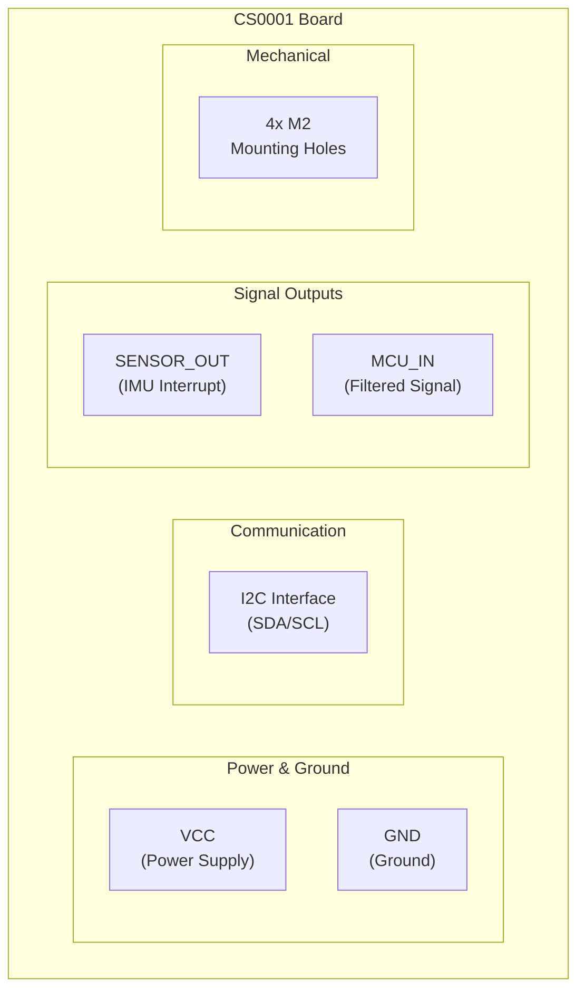
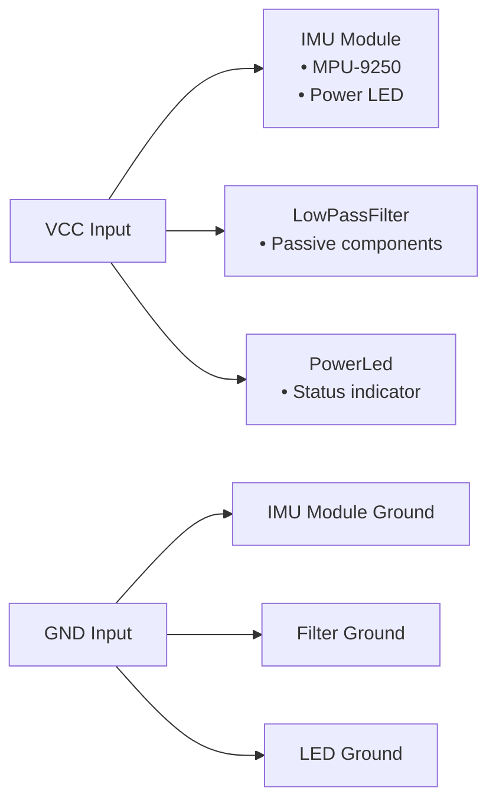
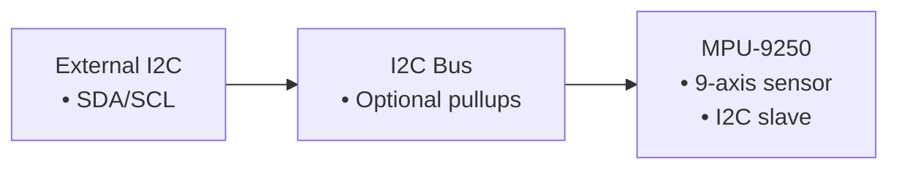
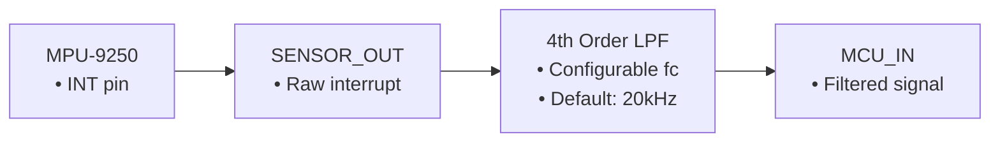
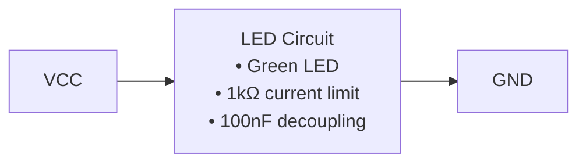

# Description

CS0001 is an IMU sensor board featuring an MPU-9250 9-axis motion sensor with integrated signal conditioning and power indication. The board provides I2C communication interface, configurable low-pass filtering for the sensor interrupt signal, and visual power indication via an LED. The design includes four M2 mounting holes for mechanical attachment.

The board combines three main functional modules:

- **IMU Sensor Module**: MPU-9250 with power indicator LED
- **Signal Conditioning**: 4th-order configurable low-pass filter
- **Power Indication**: Standalone power LED with current limiting

**Board acceptance test criteria:**

- [ ] MPU-9250 sensor responds correctly to I2C commands at expected address
- [ ] Power LED illuminates when VCC is applied within specified voltage range
- [ ] Low-pass filter provides expected frequency response on sensor interrupt signal
- [ ] I2C communication operates reliably at standard and fast-mode frequencies
- [ ] All mounting holes provide secure mechanical attachment

# Block diagram

## Board Layout with Interfaces

## Signal Path Diagrams

### 1. Power Distribution

### 2. I2C Communication Path

### 3. Signal Conditioning Path

### 4. Power Indication

## Component Details

### IMU Sensor Module (ImuSensor.zen)

- **Primary Component**: MPU-9250 9-axis motion sensor
  - 3-axis gyroscope
  - 3-axis accelerometer
  - 3-axis magnetometer
  - I2C interface (configurable address)
  - Interrupt output pin
- **Power Indicator**: Green LED with current limiting
- **Decoupling**: 100nF capacitor
- **Configuration**: Optional I2C pullup resistors (disabled by default)

### Low-Pass Filter Module (LowPassFilter.zen)

- **Topology**: 4th-order cascaded RC stages
- **Frequency Range**: 10Hz to 500kHz (configurable)
- **Default Setting**: 20kHz cutoff frequency
- **Component Values**: Optimized for standard 0402 components
- **Stages**: 4 identical RC sections for -80dB/decade rolloff

#### Filter Frequency Options

| Setting   | R Value  | C Value  | Cutoff Frequency    |
| --------- | -------- | -------- | ------------------- |
| 10Hz      | 16kΩ     | 1µF      | 10Hz                |
| 50Hz      | 3.3kΩ    | 1µF      | 50Hz                |
| 100Hz     | 1.6kΩ    | 1µF      | 100Hz               |
| 500Hz     | 330Ω     | 1µF      | 500Hz               |
| 1kHz      | 1.6kΩ    | 100nF    | 1kHz                |
| 2kHz      | 820Ω     | 100nF    | 2kHz                |
| 5kHz      | 330Ω     | 100nF    | 5kHz                |
| 10kHz     | 1.6kΩ    | 10nF     | 10kHz               |
| **20kHz** | **820Ω** | **10nF** | **20kHz** (default) |
| 50kHz     | 330Ω     | 10nF     | 50kHz               |
| 100kHz    | 1.6kΩ    | 1nF      | 100kHz              |
| 200kHz    | 820Ω     | 1nF      | 200kHz              |
| 500kHz    | 330Ω     | 1nF      | 500kHz              |

### Power LED Module (PowerLed.zen)

- **LED**: Green 0402 package
- **Current Limiting**: 1kΩ resistor
- **Decoupling**: 100nF capacitor
- **Function**: Visual power-on indication

## Interface Specifications

### Power Interface

- **VCC**: Primary power input
  - Voltage range: TBD (verify MPU-9250 specifications)
  - Current consumption: TBD (measure actual board consumption)
- **GND**: Ground reference

### I2C Interface

- **SDA**: I2C data line
- **SCL**: I2C clock line
- **Pullup Resistors**: Optional (configurable in IMU module)
- **Supported Speeds**: Standard-mode (100kHz), Fast-mode (400kHz)

### Signal Interface

- **SENSOR_OUT**: Raw MPU-9250 interrupt signal
  - Logic levels: VCC/GND
  - Drive capability: Per MPU-9250 specifications
- **MCU_IN**: Filtered interrupt signal
  - Filtered version of SENSOR_OUT
  - Reduced high-frequency noise
  - Same logic levels as SENSOR_OUT

### Mechanical Interface

- **Mounting**: 4x M2 threaded holes
- **Layout**: Positioned for secure board mounting
- **Spacing**: TBD (verify layout coordinates)

## Design Considerations

### Signal Integrity

- Low-pass filter provides anti-aliasing for interrupt signal sampling
- 4th-order response ensures sharp cutoff with minimal passband ripple
- Standard component values ensure reliable performance across temperature

### Power Management

- Decoupling capacitors on all power rails
- Visual power indication for troubleshooting
- Current-limited LED prevents excessive power consumption

### I2C Reliability

- Configurable pullup resistors accommodate various bus configurations
- Standard I2C voltage levels and timing
- Interrupt-driven operation reduces bus traffic

### Manufacturing

- All components use standard 0402 packages
- Single-sided component placement (verify from layout)
- Standard PCB thickness and stackup requirements
