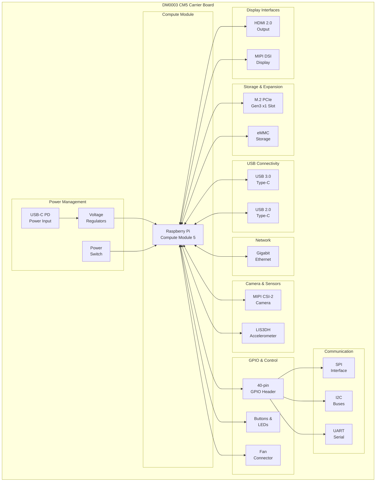

# Description

DM0003 is an advanced carrier board designed for the Raspberry Pi Compute Module 5, providing extensive connectivity and expansion options for industrial and embedded applications. The board features a comprehensive set of interfaces including dual display outputs (HDMI and DSI), high-speed PCIe connectivity via M.2 slot, USB 3.0 with Type-C Power Delivery, Gigabit Ethernet, and MIPI camera interfaces. With integrated power management, user controls, and extensive GPIO access, this carrier enables full utilization of the CM5's capabilities in professional deployments.

# Features

- Full support for Raspberry Pi Compute Module 5
- Dual display outputs: HDMI 2.0 and MIPI DSI connector
- PCIe Gen 3.0 x1 via M.2 Key M slot (2242/2260/2280)
- USB 3.0 Type-C connector with Power Delivery support
- Additional USB 2.0 port via Type-C connector
- Gigabit Ethernet with activity and speed LEDs
- MIPI CSI-2 camera interface (22-pin FPC)
- 40-pin GPIO header with SPI, I2C, UART access
- Integrated 3-axis accelerometer (LIS3DH)
- Power and reset buttons with LED indicators
- Fan connector with PWM control
- RTC battery connector
- Boot mode switch for firmware updates
- ESD protection on all external interfaces
- Efficient power distribution with multiple voltage rails

# Applications

- Industrial IoT gateways and edge servers
- Digital signage and kiosk systems
- Computer vision and AI inference platforms
- Network attached storage (NAS) systems
- Robotics control systems
- Smart building automation
- Medical imaging devices
- Educational development platforms
- Multimedia streaming servers
- Process control and monitoring systems

# Block Diagram

# Specifications

## Compute Module Support
- **Compatible Module**: Raspberry Pi Compute Module 5
- **Form Factor**: Standard CM5 dual 100-pin connectors
- **Memory**: As per CM5 variant (4GB/8GB/16GB)
- **Storage**: eMMC as per CM5 variant

## Power
- **Input**: USB Type-C with Power Delivery
- **Voltage Range**: 5V to 20V PD negotiation
- **Power Rails**: 5V, 3.3V, 1.8V
- **Protection**: Over-current, ESD protection

## Display Interfaces

### HDMI
- **Version**: HDMI 2.0
- **Resolution**: Up to 4K@60Hz
- **Features**: CEC support, ESD protection
- **Power**: 5V output for displays

### MIPI DSI
- **Connector**: 22-pin FPC
- **Lanes**: 4-lane MIPI DSI
- **Support**: Touch panel interface

## Storage & Expansion

### M.2 Slot
- **Interface**: PCIe Gen 3.0 x1
- **Key Type**: M-Key
- **Supported Sizes**: 2242, 2260, 2280
- **Use Cases**: NVMe SSD, WiFi/BT cards

## USB Interfaces

### USB 3.0 Type-C
- **Speed**: SuperSpeed (5Gbps)
- **Power Delivery**: USB PD support
- **Data Role**: Host/Device configurable

### USB 2.0 Type-C
- **Speed**: High-Speed (480Mbps)
- **Features**: OTG support

## Network

### Gigabit Ethernet
- **Speed**: 10/100/1000 Mbps
- **Connector**: RJ45 with integrated magnetics
- **Indicators**: Activity LED, Speed LED

## Camera Interface
- **Type**: MIPI CSI-2
- **Connector**: 22-pin FPC
- **Lanes**: 2-lane or 4-lane configuration
- **Power**: 3.3V camera power

## GPIO & Expansion
- **Header**: 40-pin Raspberry Pi compatible
- **Interfaces**: SPI, I2C, UART, PWM
- **Logic Levels**: 3.3V (configurable to 1.8V)
- **Protection**: ESD protection on all pins

## Sensors & Control

### Accelerometer
- **Model**: ST LIS3DH
- **Axes**: 3-axis
- **Interface**: I2C/SPI selectable
- **Features**: Motion detection, orientation

### User Interface
- **Buttons**: Power, Reset, Boot mode
- **LEDs**: Power, Activity, User-defined
- **Fan**: 4-pin PWM controlled connector

## Environmental
- **Operating Temperature**: 0°C to 70°C
- **Storage Temperature**: -20°C to 85°C
- **Humidity**: 10% to 90% non-condensing

## Mechanical
- **Dimensions**: TBD
- **Mounting**: 4x mounting holes
- **Connectors**: Industrial-grade connectors
