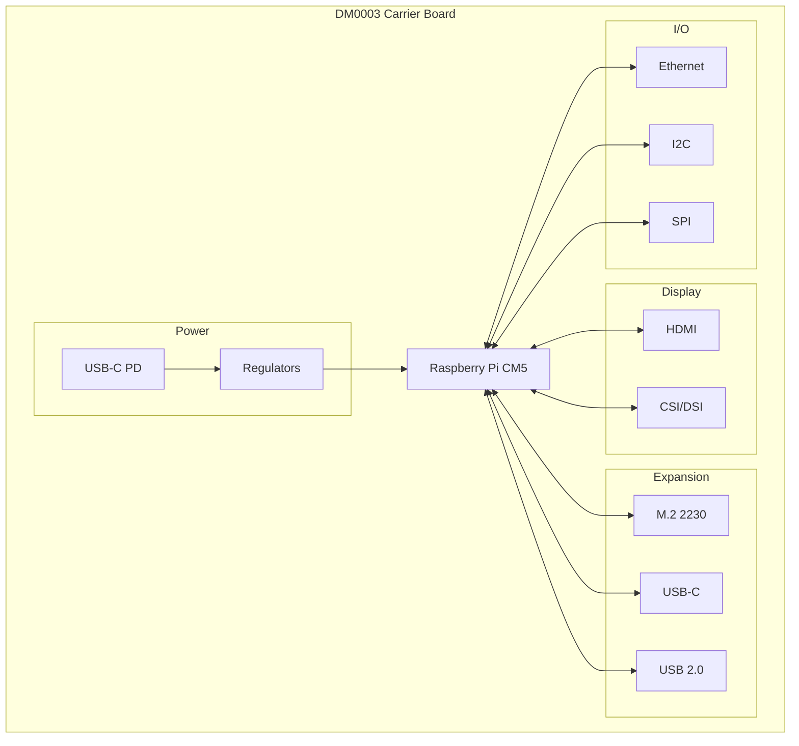

# Description

Compact carrier board for the Raspberry Pi Compute Module 5. Features HDMI, PCIe M.2, USB-C PD, and Gigabit Ethernet in a small form factor.

# Features

- Raspberry Pi Compute Module 5 support
- HDMI output + CSI/DSI connector
- PCIe M.2 M-Key 2230 slot
- USB Type-C with Power Delivery
- USB 2.0 port
- Gigabit Ethernet
- I2C and SPI expansion
- LIS3DH accelerometer
- RTC battery connector
- Fan connector with PWM
- Boot switch for flashing

# Block Diagram

# Specifications

## Mechanical
- **Dimensions**: 61.7 mm x 55.8 mm
- **Layers**: 6
- **Thickness**: 1.57 mm

## Power
- **Input**: USB Type-C Power Delivery
- **Rails**: 5V, 3.3V, 1.8V

## Display
- **HDMI**: Standard HDMI port
- **CSI/DSI**: FPC connector for camera or display

## Expansion
- **M.2**: PCIe M-Key, 2230 (NVMe SSD or AI accelerator)
- **I2C**: 3.3V connector
- **SPI**: Connector with 3 GPIOs

## Connectivity
- **Ethernet**: Gigabit (10/100/1000)
- **USB-C**: USB with Power Delivery
- **USB 2.0**: Type-A port

## Sensors
- **Accelerometer**: LIS3DH 3-axis

## Indicators
- **LEDs**: Power, Activity
