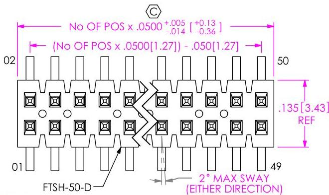

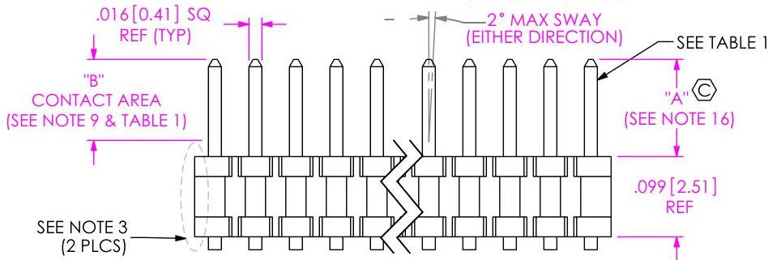
PATENT NUMBERS 5713755 / 5961339

# FIG 1

FTSH-1XX-XX-XXX-DV SHOWN

|  TABLE 1  |   |   |   |   |   |   |   |
| --- | --- | --- | --- | --- | --- | --- | --- |
|  LEAD STYLE | "A" | "B" REF | AUTOMATED BKT | "C" (OAL) | HAND FILL | "C" (OAL) | MICRO HEADER  |
|  -01 | .120 [3.05] | .070 [1.78] | *** T-1S15-15-XXX | .675[17.15] | T-1S40-03-XX-2 | .309[7.85] | T-1S40-03-XX-3  |
|  -02 | .075 [1.91] | .050 [1.27] | * T-1S15-16-XXX | .675[17.15] | * T-1S15-18-XXX | .800[20.32] | NOT AVAILABLE  |
|  -03 | .065 [1.65] | .050 [1.27] | * T-1S15-16-XXX | .675[17.15] | * T-1S15-18-XXX | .800[20.32] | NOT AVAILABLE  |
|  -04 | .150 [3.81] | .070 [1.78] | *** T-1S15-15-XXX | .675[17.15] | *** T-1S15-17-XXX | .800[20.32] | NOT AVAILABLE  |
|  -05 | .170 [4.32] | .070 [1.78] | T-1S15-03-XXX | .800[20.32] | T-1S15-03-XXX | .800[20.32] | NOT AVAILABLE  |
|  -14 | .150 [3.81] | .135 [3.43] | T-1S15-63-XXX | .800[20.32] | T-1S15-63-XXX | .800[20.32] | NOT AVAILABLE  |

* = SEE NOTE 13
*** = SEE NOTE 14

# FTSH-1XX-XX-XXX-DV-XXX-XXX

# No OF POSITIONS

-02 THRU -50

(PER ROW)

# LEAD STYLE

-01: .120 [3.05]

-02: .075 [1.91]

-03: .065 [1.65]

-04: .150 [3.81]

-05: .170 [4.32]

-14: .150 [3.81] (NOT AVAILABLE WITH -SM, FM, LM PLATING OPTIONS)

# PLATING SPECIFICATION

-L: 10μ' SELECTIVE GOLD IN CONTACT AREA, MATTE TIN ON TAIL

-F: 3μ' SELECTIVE GOLD IN CONTACT AREA, MATTE TIN ON TAIL

-H: 30μ' GOLD IN CONTACT AREA, 3μ' GOLD ON TAIL

-LM: 10μ' SELECTIVE GOLD IN CONTACT AREA, MATTE TIN ON TAIL

-FM: 3μ' SELECTIVE GOLD IN CONTACT AREA, MATTE TIN ON TAIL

-SM: 30μ' SELECTIVE GOLD IN CONTACT AREA, MATTE TIN ON TAIL

-LTL: 10μ' SELECTIVE GOLD IN CONTACT AREA, TIN/LEAD (90/10+/-5%) TAIL

-G: 10μ' GOLD IN CONTACT AREA, 3μ' GOLD ON TAIL

-STL: 30μ' SELECTIVE GOLD IN CONTACT AREA, TIN/LEAD (90/10 +/-5%) ON TAIL

# TAIL OPTION

-DV: DOUBLE VERTICAL

# OPTIONS

-P: PICK &amp; PLACE PAD (4 POS MIN)

(SEE FIG 11, SHT 4 &amp; TABLE 5)

-TR: TAPE &amp; REEL PACKAGING (SEE NOTE 18)

(NOT AVAILABLE WITH -EJC, -EC &amp; -EPC, SEE NOTE 11)

-FR: FULL REEL QTY. TAPE AND REEL (SEE NOTE17)

-ES: END SHROUDS (SEE FIG 6, SHT 3)

(MOLDED IN 5 POS MIN: -02 &amp; -03 LEAD STYLE ONLY)

(SNAP SHROUDS 9 POS MIN: -02 &amp; -03 LEAD STYLE ONLY)

-EJ: EJECTOR SHROUDS; SEE FIG 4, SHT 2

(10 POS MIN: -01 LEAD STYLE ONLY)

-EJM: EJECTOR SHROUDS WITH MOLDED ALIGNMENT PIN

(SEE FIG 5, SHT 2; 10 POS MIN: -01 LEAD STYLE ONLY; NOT VALID WITH -A OPTION)

-EJC: LOCKING CLIP (SEE FIG 7, SHT 3 &amp; NOTE 11)

(9 POS MIN: -02 &amp; -03 LEAD STYLE ONLY)

-EP: GUIDE POST (SEE FIG 8, SHT 3; 9 POS MIN: -02 &amp; -03 LEAD STYLE ONLY) (USE ONLY WHEN MATING WITH CLIP)

-EL: BOARD LOCK (SEE FIG 9, SHT 3)

(9 POS MIN: -02 &amp; -03 LEAD STYLE ONLY)

(USE ONLY WHEN MATING WITH CLIP)

-EPC: GUIDE POST &amp; LOCKING CLIP

(SEE FIG 10, SHT 3 &amp; NOTE 11; USE ONLY WHEN MATING WITH CLIP)

(9 POS MIN: -02 &amp; -03 LEAD STYLE ONLY; NOT VALID WITH -A OPTION)

-A: ALIGNMENT PIN (MOLDED OR STAKED; SEE FIG 3, SHT 2)

(MOLDED: 3 POS MIN: STAKED; 6 POS MIN)

(SAMTEC DISCRETION ON WHICH -A PIN USED)

-K: KEYING OPTION FOR MATING WITH FFSD

(SEE TABLE 3, SHT 2; 05 THRU 25 AVAILABLE AS STANDARD)

(POSITION 13, 17, 20 &amp; 25 AVAILABLE WITH -EXX OPTION)

(LEAD STYLE -01 ONLY, SEE FIG 2, SHT 2 &amp; NOTE 12)

(ALIGNMENT PIN AVAILABLE WITH -E OPTION BUT MUST BE MOLDED)

(MUST USE FTSH-50-CN-XX-X OR FTSHC-50-CN-XX-X)

-M: METAL PICK &amp; PLACE PAD (5 POS MIN: USE MPP-22-5)

(SEE FIG 12, SHT 4; NOT AVAILABLE WITH -X OPTION)

# POLARIZING OPTION

XXX INDICATES POSITION TO BE OMITTED

(NOT AVAILABLE WITH EXX OPTIONS)

(ONLY AVAILABLE WITH -F, -FM, -L, -LM PLATING OPTIONS)

* = NOT ENGINEERING APPROVED

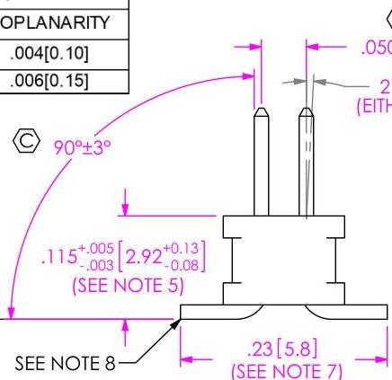

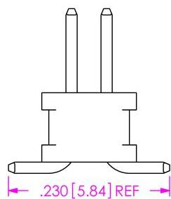
HAND FILL USING T-1S40

|  UNLESS OTHERWISE SPECIFIED. DIMENSIONS ARE IN INCHES. TOLERANCES ARE: DECIMALS ANGLES .XX: ±.01 [3] 1* .XXX: ±.005 [13] .XXXX: ±.0010 [.025] |   | * PROPRIETARY NOTE THIS DOCUMENT CONTAINS CONFIDENTIAL AND PROPRIETARY INFORMATION AND ALL GOODS WITHOUT WAIVE, REPRODUCTION, USE, AND EXTENT AND MADE IN WAY TO PRODUCE REQUIRED BY SAMPLE, AND THIS DOCUMENT SHALL NOT BE DISCLOSED, IN WHOLE OR PART, TO ANY UNAUTHORIZED PERSON OR ENTITY NOT REPRODUCED, TRANSFERRED OR INCORPORATED IN ANY OTHER PROJECT IN ANY MANNER WITHOUT THE EXPRESS WAIVYM CONSENT OF SAMPLE, INC.  |
| --- | --- | --- |
|  MATERIAL: DO NOT SCALE DRAWING SHEET SCALE: 5:1 INSULATOR: LCP UL 94 VO TERMINAL: PHOSPHOR BRONZE |   | S20 PARK EAST BLVD, NEW ALBANY, IN 47150 PHONE: 812-944-6733 FAX: 812-948-5047 e-mail: info@SAMTEC.com code: 55322  |
|  F:\DWG\MISC\MKTG\FTSH-1XX-XX-XXX-DV-XXX-XXX-MKT.SLODRW |   | DESCRIPTION: 050 x .050 CL DOUBLE VERTICAL SMT TERMINAL STRIP  |
|   |   | DWG. NO. FTSH-1XX-XX-XXX-DV-XXX-XXX  |
|   |   | BY: PURVIS 10/12/1995 SHEET 1 OF 5  |# REVISION FQ

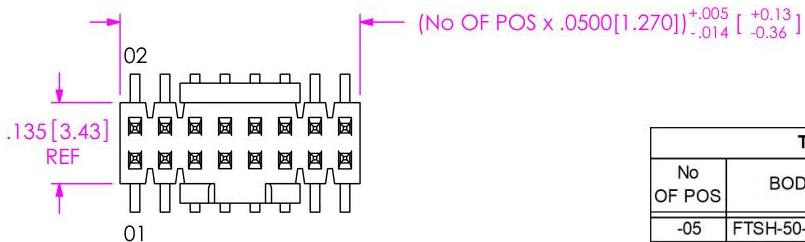

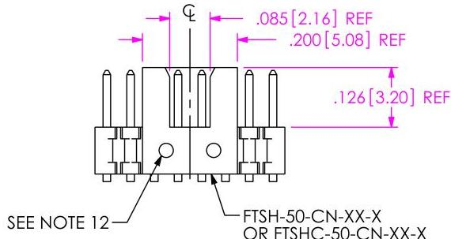
FIG 2 K OPTION (LEAD STYLE -01 ONLY) (DIFFERENT AS SHOWN, OTHERWISE SAME AS FIG 1) (POSITION 13, 17, 20 &amp; 25 AVAILABLE WITH -EXX OPTION)

|  TABLE 3  |   |   |
| --- | --- | --- |
|  No OF POS | BODY | No OF PARTS PER FULL STRIP  |
|  -05 | FTSH-50-CN-05 | 10  |
|  -06 | FTSH-50-CN-06 | 8  |
|  -07 | FTSH-50-CN-07 | 7  |
|  -08 | FTSH-50-CN-08 | 6  |
|  -09 | FTSH-50-CN-09 | 5  |
|  -10 | FTSH-50-CN-10 | 5  |
|  -11 | FTSH-50-CN-11 | 4  |
|  -12 | FTSH-50-CN-12 | 4  |
|  -13 | FTSH-50-CN-13 | 3  |
|  -14 | FTSH-50-CN-14 | 3  |
|  -15 | FTSH-50-CN-15 | 3  |
|  -16 | FTSH-50-CN-16 | 3  |
|  -17 | FTSH-50-CN-17 | 2  |
|  -18 | FTSH-50-CN-18 | 2  |
|  -19 | FTSH-50-CN-19 | 2  |
|  -20 | FTSH-50-CN-20 | 2  |
|  -21 | FTSH-50-CN-21 | 2  |
|  -22 | FTSH-50-CN-22 | 2  |
|  -23 | FTSH-50-CN-23 | 2  |
|  -24 | FTSH-50-CN-24 | 2  |
|  -25 | FTSH-50-CN-25 | 2  |

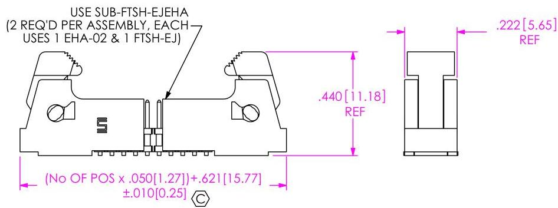

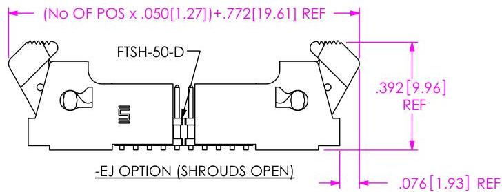
FIG 4 -EJ OPTION (DIFFERENT AS SHOWN, OTHERWISE SAME AS FIG 1) (-01 LEAD STYLE ONLY)

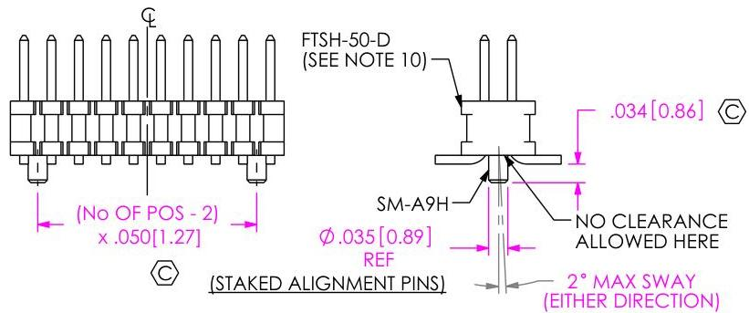

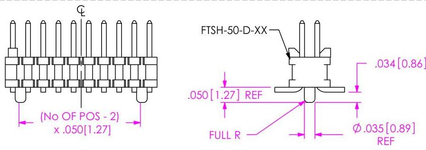
FIG 3 -A OPTION (DIFFERENT AS SHOWN, OTHERWISE SAME AS FIG 1) (6 POSITION MINIMUM FOR STAKED ALIGNMENT PINS) (3 POSITION MINIMUM FOR MOLDED ALIGNMENT PINS)

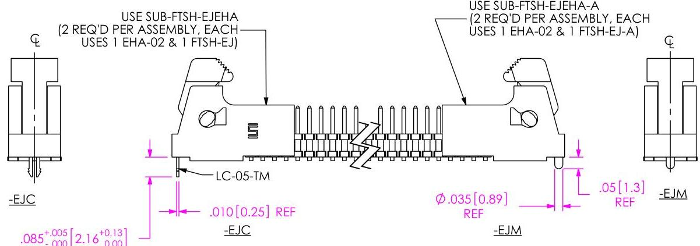

FIG 5 -EJC &amp; -EJM OPTIONS (DIFFERENT AS SHOWN, OTHERWISE SAME AS FIG 4) (-01 LEAD STYLE ONLY)

|  PROPRIETARY NOTE THIS DOCUMENT CONTAINS CONFIDENTIAL AND PROPRIETARY INFORMATION AND ALL LEGALS, INSTRUCTIONS, REPRODUCTION, USE, PATENT RIGHTS AND SALES RIGHTS ARE EXPRESSLY RESERVED BY SAMPLE, INC. THIS DOCUMENT SHALL NOT BE DISCLOSSED, IN WHOLE OR PART, TO ANY UNAUTHORIZED PERSON OR ENTITY WITH REPRODUCED, TRANSFERRED OR INCORPORATED IN ANY OTHER PROJECT IN ANY MANNER WITHOUT THE EXPRESS WRITTEN CONSENT OF SAMPLE, INC. DO NOT SCALE DRAWING SHEET SCALE: 3:1 | SAMPLE 520 PARK EAST BLVD, NEW ALBANY, IN 47150 PHONE: 812-944-6733 FAX: 812-948-5047 e-Mail info@SAMTEC.com code 55322  |
| --- | --- |
|   |  DESCRIPTION: .050 x .050 CL DOUBLE VERTICAL SMT TERMINAL STRIP  |
|   |  DWG. NO. FTSH-1XX-XX-XXX-DV-XXX-XXX  |
|  BY: PURVIS 10/12/1995 | SHEET 2 OF 5  |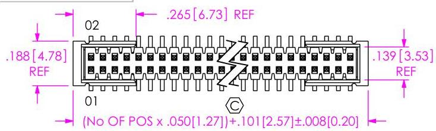
REVISION FQ

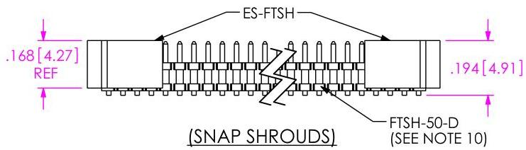

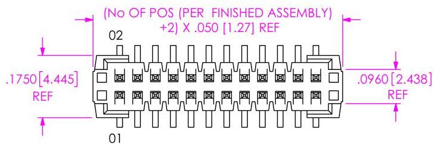

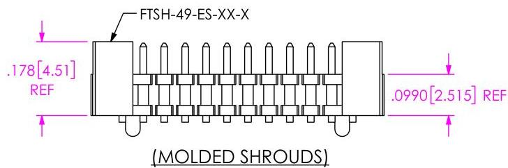
FIG 6
-ES OPTION
(DIFFERENT AS SHOWN, OTHERWISE SAME AS FIG 1)
(USE -02 OR -03 LEAD STYLE ONLY)
(9 POS MIN FOR SNAP SHROUDS)
(5 POS MIN FOR MOLDED SHROUDS)

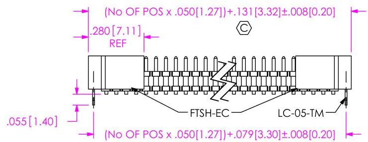
FIG 7
-EC OPTION
(DIFFERENT AS SHOWN, OTHERWISE SAME AS FIG 6)

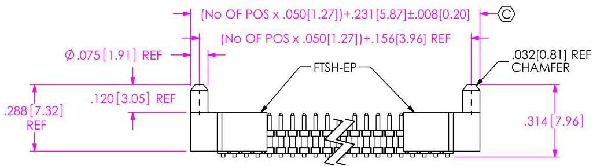
FIG 8
-EP OPTION
(DIFFERENT AS SHOWN, OTHERWISE SAME AS FIG 6)
(USE ONLY WHEN MATING WITH CLP)

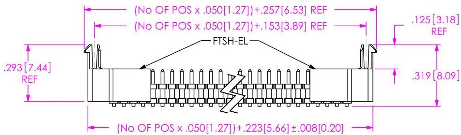
FIG 9
-EL OPTION
(DIFFERENT AS SHOWN, OTHERWISE SAME AS FIG 6)
(USE ONLY WHEN MATING WITH CLP)

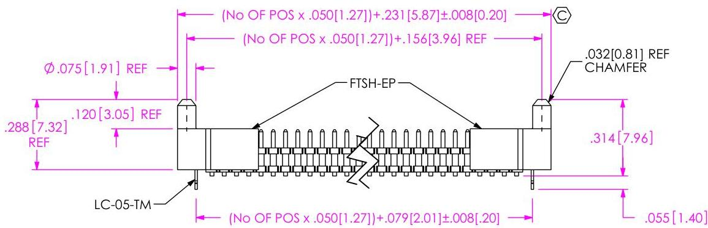
FIG 10
-EPC OPTION
(DIFFERENT AS SHOWN, OTHERWISE SAME AS FIG 6)
(USE ONLY WHEN MATING WITH CLP)

520 PARK EAST BLVD, NEW ALBANY, IN 47150
PHONE: 812-944-6733 FAX: 812-948-5047
e-Mail info@SAMTEC.com code 55322

# REVISION FQ

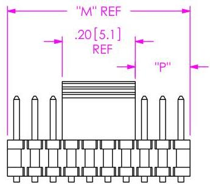

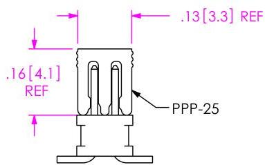

"M" REF = OVERALL LENGTH
"P" = {("M" - .200 [5.08]) / 2} ± .020 [.51]

|  TABLE 5  |   |   |
| --- | --- | --- |
|  OPTION(S) | PAD | MIN. POS  |
|  NONE, -A | PPP-25** | 4  |
|  -EJ, -EJC, -EJM | PPP-41 | 10  |
|  -ES, -EC, -EP, -EL | PPP-25** | 9  |
|  -EPC | PPP-25** | 5*  |
|  -K | PPP-25-KT | 5  |
|  -K-EJ | PPP-25-KT | 10  |

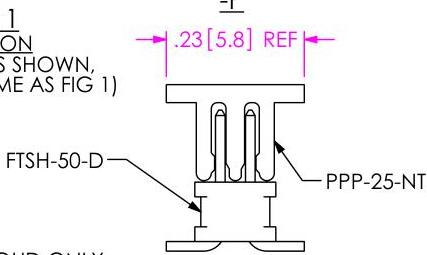
*MOLDED SHROUD ONLY
** USE PPP-25-NT WITH -TR PACKAGING ONLY

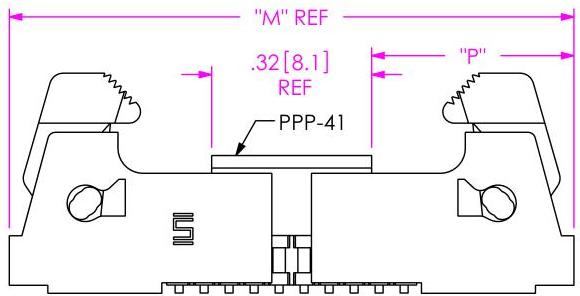
"M" REF = OVERALL LENGTH
"P" = {("M" - .32 [8.1]) / 2} ± .020 [.51]

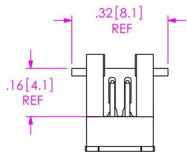
-EJ-P &amp; -EJX-P
(DIFFERENT AS SHOWN, OTHERWISE SAME AS FIGS 4 &amp; 5)

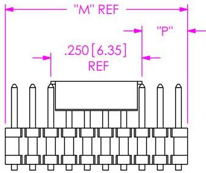

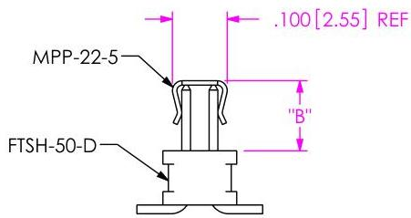
"M" REF = OVERALL LENGTH
"P" = {("M" - .250[6.35]) / 2} ± .020[0.51]

FIG 12
*M: METAL PICK &amp; PLACE PAD
(DIFFERENT AS SHOWN, OTHERWISE SAME AS FIG 1)
(NOT AVAILABLE WITH -K OPTION)(5 POS MIN)
* = NOT ENGINEERING APPROVED

F:\DWG\MISC\MKTO\FTSH-1XX-XX-XXX-DV-XXX-XXX-MKT.SLDDRW

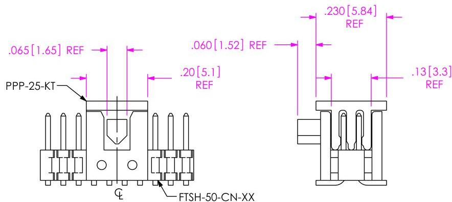
-K-P-TR/FR
(DIFFERENT AS SHOWN, OTHERWISE SAME AS FIG 2)

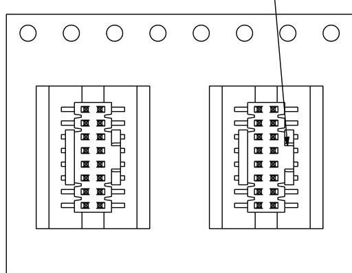
NOTE: TAPE &amp; REEL ORIENTATION:
POLARIZATION NOTCH TO THE RIGHT

TAPE &amp; REEL VIEW
USER DIRECTION OF UN-REELING POCKET NOT DETAILED

|  TABLE 4  |   |
| --- | --- |
|  LEAD STYLE | “B” REF  |
|  -01 | .125 [3.18]  |
|  -02 | .080 [2.03]  |
|  -03 | .070 [1.78]  |
|  -04 | .155 [3.94]  |
|  -14 | .155 [3.94]  |

PROPRIETARY NOTE
THIS DOCUMENT CONTAINS CONFIDENTIAL AND
PROPRIETARY INFORMATION AND ALL DISCS, INCLUDING
MANUFACTURING, REPRODUCTION, USE, PAYENT RIGHTS AND
ONLY RIGHTS ARE EXPRESSLY RESERVED BY SAMPLE,
AND, THIS DOCUMENT SHALL NOT BE DISCLOSED, IN WHOLE OR PART, TO ANY UNAUTHORIZED PERSON OR ENTITY WITH
REPRODUCTS, TRANSFERRED OR INCORPORATED IN ANY OTHER PROJECT IN ANY MANNER WITHOUT THE EXPRESS
WRITTEN CONSENT OF SAMPLE, INC.

DO NOT SCALE DRAWING

SHEET SCALE: 3:1

520 PARK EAST BLVD, NEW ALBANY, IN 47150
PHONE: 812-944-6733 FAX: 812-948-5047
e-Mail info@SAMTEC.com code 55322

DESCRIPTION:
.050 x .050 CL DOUBLE VERTICAL SMT TERMINAL STRIP

DWG. NO.
FTSH-1XX-XX-XXX-DV-XXX-XXX

BY: PURVIS 10/12/1995 SHEET 4 OF 5# REVISION FQ

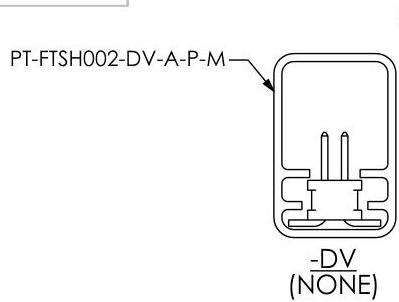

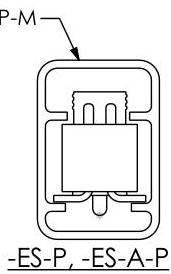

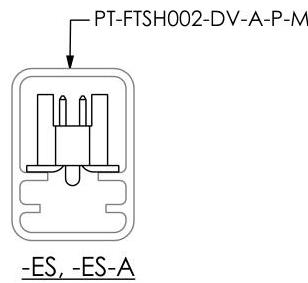

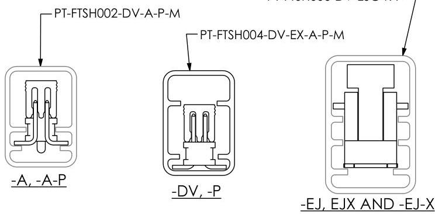

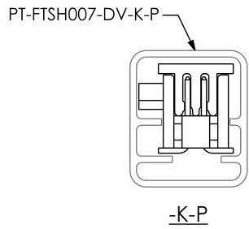

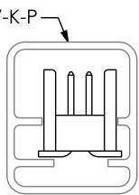

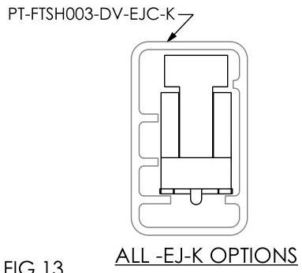

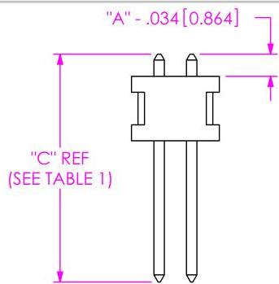
IN PROCESS 1 W/O A PINS

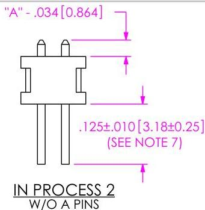

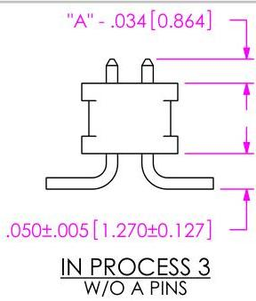

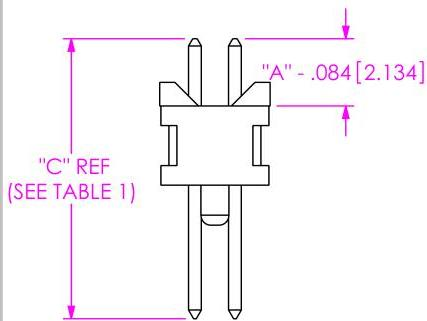
IN PROCESS 1 WITH A PINS*

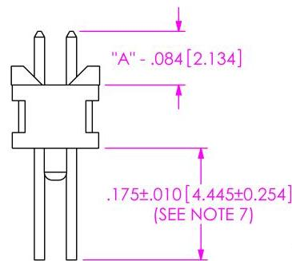
IN PROCESS 2 WITH A PINS*

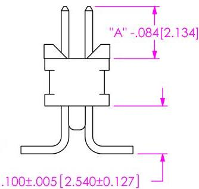
IN PROCESS 3 WITH A PINS*

* = FOR -01, -04, -05 AND -14 LEAD STYLES ONLY

IN-PROCESS VIEWS ARE FOR HANDFILL ONLY

|  TABLE 2  |   |   |
| --- | --- | --- |
|  OPTION(S) | PACKAGING TUBE | TUBE PLUG  |
|  -ES, -ES-A, -NONE
-A, -A-P | PT-FTSH002-DV-A-P-M | TP-03  |
|  -K-A-P, -K-P (-01 LEAD STYLE ONLY)
-K-P (-04 LEAD STYLE ONLY)
-K, -K-A (FOR -01 LEAD STYLE ONLY) | PT-FTSH007-DV-K-P | TP-09  |
|  -ES-P, -ES-A-P
-EC, -EC-P, -EL-P
-EP, -EP-A, EP-P, -EP-A-P
-EPC, -EPC-D, -EPC-P
-EL, -EL-A, -EL-A-P
-P (ALL LEAD STYLES) | PT-FTSH004-DV-EX-A-P-M | TP-03  |
|  -EJ-K, -EJ-K-P
-EJ-K-A, -EJ-K-A-P | PT-FTSH003-DV-EJC-K | TP-03  |
|  -EJ, -EJ-P, -EJ-A-P, -EJ-A, -EJM, -EJC | PT-FTSH006-DV-EJC-K-P | TP-03  |

520 PARK EAST BLVD, NEW ALBANY, IN 47150

PHONE: 812-944-6733 FAX: 812-948-5047

e-Mail info@SAMTEC.com code 55322

DESCRIPTION:

.050 x .050 CL DOUBLE VERTICAL SMT TERMINAL STRIP

DWG. NO.

FTSH-1XX-XX-XXX-DV-XXX-XXX

BY: PURVIS 10/12/1995 SHEET 5 OF 5

