# HD3SS3212x Two-Channel Differential 2:1/1:2 USB3.1 Mux/Demux 

## 1 Features

- Provides MUX/DEMUX Solution for USB Type$\mathrm{C}^{\text {TM }}$ Ecosystem for USB 3.1 Gen 1 and Gen 2 Data Rates
- Compatible With MIPI DSI/CSI, FPDLinkIII, LVDS, and PCIE Gen II, III
- Operates up to 10 Gbps
- Wide -3-dB Differential BW of over 8 GHz
- Excellent Dynamic Characteristics (at 5 GHz )
- Crosstalk $=-32 \mathrm{~dB}$
- Off Isolation $=-19 \mathrm{~dB}$
- Insertion Loss $=-1.6 \mathrm{~dB}$
- Return Loss $=-12 \mathrm{~dB}$
- Bidirectional "Mux/De-Mux" Differential Switch
- Supports Common Mode Voltage 0 to 2 V
- Single Supply Voltage $\mathrm{V}_{\mathrm{CC}}$ of 3.3 V
- Commercial Temperature Range of $0^{\circ} \mathrm{C}$ to $70^{\circ} \mathrm{C}$ (HD3SS3212RKS)
- Industrial Temperature Range of $-40^{\circ} \mathrm{C}$ to $85^{\circ} \mathrm{C}$ (HD3SS3212IRKS)

## 2 Applications

- USB Type-C ${ }^{\text {TM }}$ Ecosystem
- Desktop and Notebook PCs
- Server/Storage Area Networks
- PCI Express Backplanes
- Shared I/O Ports
- FPDLinkII and FPDLinkIII Switching

## Simplified Schematic

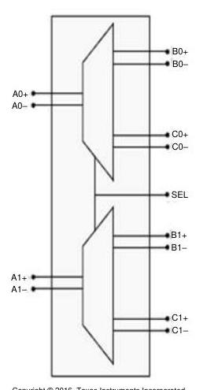

## 3 Description

The HD3SS3212 is a high-speed bidirectional passive switch in mux or demux configurations suited for USB Type-C ${ }^{\text {TM }}$ application supporting USB 3.1 Gen 1 and Gen 2 data rates. Based on control pin SEL, the device provides switching on differential channels between Port B or Port C to Port A.
The HD3SS3212 is a generic analog differential passive switch that can work for any high-speed interface applications requiring a common mode voltage range of 0 to 2 V and differential signaling with differential amplitude up to 1800 mVpp . It employs adaptive tracking that ensures the channel remains unchanged for the entire common mode voltage range.
Excellent dynamic characteristics of the device allow high-speed switching with minimum attenuation to the signal eye diagram with very little added jitter. It consumes $<2 \mathrm{~mW}$ of power when operational and has a shutdown mode exercisable by OEn pin resulting $<20 \mu \mathrm{~W}$.

Device Information ${ }^{(1)}$

| PART NUMBER | PACKAGE | BODY SIZE (NOM) |
| :-- | :-- | :-- |
| HD3SS3212 | VQFN (20) | $2.50 \mathrm{~mm} \times 4.50 \mathrm{~mm} \times$ |

(1) For all available packages, see the orderable addendum at the end of the data sheet.
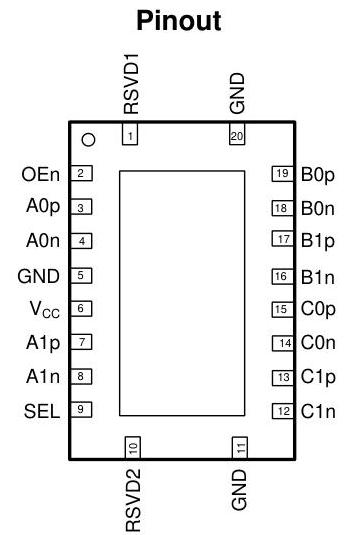# Table of Contents 

1 Features ..... 1
2 Applications ..... 1
3 Description ..... 1
4 Revision History ..... 2
5 Device Comparison Table ..... 4
6 Pin Configuration and Functions ..... 4
7 Specifications ..... 5
7.1 Absolute Maximum Ratings ..... 5
7.2 ESD Ratings ..... 5
7.3 Recommended Operating Conditions ..... 5
7.4 Thermal Information ..... 5
7.5 Electrical Characteristics ..... 6
7.6 High-Speed Performance Parameters ..... 6
7.7 Switching Characteristics ..... 7
8 Parameter Measurement Information ..... 7
9 Detailed Description ..... 9
9.1 Overview ..... 9
9.2 Functional Block Diagram ..... 9
9.3 Feature Description ..... 9
9.4 Device Functional Modes ..... 10
10 Application and Implementation ..... 11
10.1 Application Information ..... 11
10.2 Typical Applications ..... 14
10.3 Systems Examples ..... 15
11 Power Supply Recommendations ..... 18
12 Layout ..... 18
12.1 Layout Guidelines ..... 18
12.2 Layout Example ..... 18
13 Device and Documentation Support ..... 19
13.1 Related Links ..... 19
13.2 Receiving Notification of Documentation Updates ..... 19
13.3 Community Resources ..... 19
13.4 Trademarks ..... 19
13.5 Electrostatic Discharge Caution ..... 19
13.6 Glossary ..... 19
14 Mechanical, Packaging, and Orderable Information ..... 19

## 4 Revision History

NOTE: Page numbers for previous revisions may differ from page numbers in the current version.
Changes from Revision E (May 2016) to Revision F Page

- Deleted text "Internally tied to GND via 100-k $\Omega$ resistor." from the SEL pin in the Pin Functions table ..... 4
Changes from Revision D (March 2016) to Revision E Page
- Changed Features From: Single Supply Voltage $V_{C C}$ of $3.3 \mathrm{~V} \pm 10 \%$ To: Single Supply Voltage $V_{C C}$ of 3.3 V ..... 1
- Changed text "HD3SS3212 requires 3.3-V $\pm 10 \%$ " To: "HD3SS3212 requires 3.3-V" in the Design Requirements section ..... 14
- Changed Figure 11, moved $0.1 \mu \mathrm{~F}$ capacitors From: pins 7 and 8 To: pins 3 and 4 ..... 15
Changes from Revision C (January 2016) to Revision D Page
- Changed the $\mathrm{V}_{\mathrm{CC}}$ MIN value From: 3 V To: 2.7 V in Recommended Operating Conditions ..... 5
Changes from Revision B (January 2016) to Revision C Page
- Changed the PINOUT image - pin 1 From: NC To: RSVD1 and pin 10 From: NC To: RSVD2 ..... 1
- Changed pin 1 From: NC To: RSVD1, changed pin 10 From: NC To: RSVD2, and updated the Description in the Pin Functions table ..... 5
Changes from Revision A (August 2015) to Revision B Page
- Changed the $\mathrm{V}_{\mathrm{a}}$, MIN value From: 2 V To: 1.7 V in Recommended Operating Conditions ..... 5Changes from Original (May 2015) to Revision A ..... Page

- Removed "or GND" from NC pin description ..... 5
- Updated Figure 16 ..... 18# 5 Device Comparison Table 

| OPERATING TEMPERATURE $\left({ }^{\circ} \mathbf{C}\right)$ | PACKAGE $^{(1)(2)}$ |  | ORDERABLE PART NUMBER |
| :--: | :--: | :--: | :--: |
| 0 to 70 | RKS | 20 pins | HD3SS3212RKSR |
| -40 to 85 | RKS | 20 pins | HD3SS3212IRKSR |

(1) For the most current package and ordering information, see Mechanical, Packaging, and Orderable Information.
(2) Package drawings, thermal data, and symbolization are available at www.ti.com/packaging.

## 6 Pin Configuration and Functions

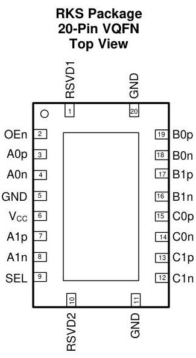

Pin Functions

| PIN |  | TYPE $^{(1)}$ | DESCRIPTION |
| :--: | :--: | :--: | :--: |
| NAME | NO. |  |  |
| $V_{C C}$ | 6 | $P$ | 3.3-V power |
| OEn | 2 | I | Active-low chip enable   L: Normal operation   H: Shutdown |
| A0p | 3 | I/O | Port A, channel 0, high-speed positive signal |
| A0n | 4 | I/O | Port A, channel 0, high-speed negative signal |
| GND | $5,11,20$ | G | Ground |
| A1p | 7 | I/O | Port A, channel 1, high-speed positive signal |
| A1n | 8 | I/O | Port A, channel 1, high-speed negative signal |
| SEL | 9 | I | Port select pin.   L: Port A to Port B   H: Port A to Port C |
| C1n | 12 | I/O | Port C, channel 1, high-speed negative signal (connector side) |
| C1p | 13 | I/O | Port C, channel 1, high-speed positive signal (connector side) |
| C0n | 14 | I/O | Port C, channel 0, high-speed negative signal (connector side) |
| C0p | 15 | I/O | Port C, channel 0, high-speed positive signal (connector side) |
| B1n | 16 | I/O | Port B, channel 1, high-speed negative signal (connector side) |
| B1p | 17 | I/O | Port B, channel 1, high-speed positive signal (connector side) |
| B0n | 18 | I/O | Port B, channel 0, high-speed negative signal (connector side) |

(1) The high-speed data ports incorporate $20-\mathrm{k} \Omega$ pulldown resistors that are switched in when a port is not selected and switched out when the port is selected.# Pin Functions (continued) 

| PIN |  | TYPE $^{(1)}$ | DESCRIPTION |
| :--: | :--: | :--: | :--: |
| NAME | NO. |  |  |
| B0p | 19 | I/O | Port B, channel 0, high-speed positive signal (connector side) |
| RSVD1 | 1 | 0 | Can be left not connected or can be fed to $\mathrm{V}_{\mathrm{CC}}$ |
| RSVD2 | 10 | 0 |  |

## 7 Specifications

### 7.1 Absolute Maximum Ratings

see ${ }^{(1)}$

|  |  |  | MIN | MAX | UNIT |
| :--: | :--: | :--: | :--: | :--: | :--: |
| $\mathrm{V}_{\mathrm{CC}}$ | Supply voltage |  | $-0.5$ | 4 | V |
|  | Voltage | Differential I/O | $-0.5$ | 2.5 | V |
|  |  | Control pins | $-0.5$ | $\mathrm{V}_{\mathrm{CC}}+0.5$ |  |
| $\mathrm{T}_{\text {stg }}$ | Storage temperature |  | $-65$ | 150 | ${ }^{\circ} \mathrm{C}$ |

(1) Stresses beyond those listed under Absolute Maximum Ratings may cause permanent damage to the device. These are stress ratings only, which do not imply functional operation of the device at these or any other conditions beyond those indicated under Recommended Operating Conditions. Exposure to absolute-maximum-rated conditions for extended periods may affect device reliability.

### 7.2 ESD Ratings

| $\mathrm{V}_{\text {(ESD) }}$ | Electrostatic discharge | Human-body model (HBM), per ANSI/ESDA/JEDEC JS-001 ${ }^{(1)}$ |  | VALUE | UNIT |
| :--: | :--: | :--: | :--: | :--: | :--: |
|  |  | Charged-device model (CDM), per JEDEC specification JESD22-C101 ${ }^{(2)}$ |  | $\pm 2000$ | V |

(1) JEDEC document JEP155 states that 500-V HBM allows safe manufacturing with a standard ESD control process.
(2) JEDEC document JEP157 states that 250-V CDM allows safe manufacturing with a standard ESD control process.

### 7.3 Recommended Operating Conditions

over operating free-air temperature range (unless otherwise noted)

|  |  |  | MIN | MAX | UNIT |
| :--: | :--: | :--: | :--: | :--: | :--: |
| $\mathrm{V}_{\mathrm{CC}}$ | Supply voltage |  | 2.7 | 3.6 | V |
| $\mathrm{V}_{\text {th }}$ | Input high voltage (SEL, OEn pins) |  | 1.7 | $\mathrm{V}_{\mathrm{CC}}$ | V |
| $\mathrm{V}_{\mathrm{s}}$ | Input low voltage (SEL, OEn pins) |  | $-0.1$ | 0.8 | V |
| $\mathrm{V}_{\text {diff }}$ | High-speed signal pins differential voltage |  | 0 | 1.8 | $\mathrm{V}_{\mathrm{pp}}$ |
| $\mathrm{V}_{\text {om }}$ | High speed signal pins common mode voltage |  | 0 | 2 | V |
| $T_{A}$ | Operating free-air/ambient temperature | HD3SS3212RKS | 0 | 70 | ${ }^{\circ} \mathrm{C}$ |
|  |  | HD3SS3212IRKS | $-40$ | 85 |  |

### 7.4 Thermal Information

| THERMAL METRIC ${ }^{(1)}$ |  | HD3SS3212 |  |
| :--: | :--: | :--: | :--: |
|  |  | RKS (VQFN) | UNIT |
|  |  | 20 PINS |  |
| $R_{i j, J A}$ | Junction-to-ambient thermal resistance | 46.6 | ${ }^{\circ} \mathrm{C} / \mathrm{W}$ |
| $R_{i j, J C(\text { top) }}$ | Junction-to-case (top) thermal resistance | 41.8 | ${ }^{\circ} \mathrm{C} / \mathrm{W}$ |
| $R_{i j, J B}$ | Junction-to-board thermal resistance | 4.4 | ${ }^{\circ} \mathrm{C} / \mathrm{W}$ |
| $\psi_{J T}$ | Junction-to-top characterization parameter | 17.6 | ${ }^{\circ} \mathrm{C} / \mathrm{W}$ |
| $\psi_{J B}$ | Junction-to-board characterization parameter | 1.6 | ${ }^{\circ} \mathrm{C} / \mathrm{W}$ |
| $R_{i j, J C(\text { bot) }}$ | Junction-to-case (bottom) thermal resistance | 17.6 | ${ }^{\circ} \mathrm{C} / \mathrm{W}$ |

(1) For more information about traditional and new thermal metrics, see the Semiconductor and IC Package Thermal Metrics application report.# 7.5 Electrical Characteristics 

| PARAMETER |  | TEST CONDITIONS | MIN | TYP | MAX | UNIT |
| :--: | :--: | :--: | :--: | :--: | :--: | :--: |
| $\mathrm{I}_{\mathrm{CC}}$ | Device active current | $\mathrm{V}_{\mathrm{CC}}=3.3 \mathrm{~V}, \mathrm{OEn}=0$ |  | 0.6 | 0.8 | mA |
| $\mathrm{I}_{\text {STDN }}$ | Device shutdown current | $\mathrm{V}_{\mathrm{CC}}=3.3 \mathrm{~V}, \mathrm{OEn}=\mathrm{V}_{\mathrm{CC}}$ |  | 5 | 20 | $\mu \mathrm{A}$ |
| $\mathrm{C}_{\text {ON }}$ | Output ON capacitance |  |  | 0.6 |  | pF |
| $\mathrm{C}_{\text {OFF }}$ | Output OFF capacitance |  |  | 0.8 |  | pF |
| $R_{O N}$ | Output ON resistance | $\begin{aligned} & \mathrm{V}_{\mathrm{CC}}=3.3 \mathrm{~V} ; \mathrm{V}_{\mathrm{CM}}=0 \text { to } 2 \mathrm{~V} ; \\ & \mathrm{I}_{\mathrm{O}}=-8 \mathrm{~mA} \end{aligned}$ |  | 5 | 8 | $\Omega$ |
| $\Delta R_{\text {ON }}$ | On-resistance match between pairs of the same channel | $\begin{aligned} & \mathrm{V}_{\mathrm{CC}}=3.3 \mathrm{~V} ;-0.35 \mathrm{~V} \leq \mathrm{V}_{\mathrm{IN}} \leq 2.35 \mathrm{~V} ; \\ & \mathrm{I}_{\mathrm{O}}=-8 \mathrm{~mA} \end{aligned}$ |  |  | 0.5 | $\Omega$ |
| $R_{\text {FLAT_ON }}$ | On-resistance flatness RON(MAX) -   RON(MAIN) | $\mathrm{V}_{\mathrm{CC}}=3.3 \mathrm{~V} ;-0.35 \mathrm{~V} \leq \mathrm{V}_{\mathrm{IN}} \leq 2.35 \mathrm{~V}$ |  |  | 1 | $\Omega$ |
| $\mathrm{I}_{\text {IH,CTRL }}$ | Input high current, control pins (SEL, OEn) |  |  |  | 1 | $\mu \mathrm{A}$ |
| $\mathrm{I}_{\text {IL,CTRL }}$ | Input low current, control pins (SEL, OEn) |  |  |  | 1 | $\mu \mathrm{A}$ |
| $\mathrm{I}_{\text {IH,HS }}$ | Input high current, high-speed pins [Ax/Bx/Cx][p/n] | $\mathrm{V}_{\mathrm{IN}}=2 \mathrm{~V}$ for selected port, A and B with SEL $=0$, and $A$ and $C$ with SEL $=\mathrm{V}_{\mathrm{CC}}$ |  |  | 1 | $\mu \mathrm{A}$ |
| $\mathrm{I}_{\text {IH,HS }}$ | Input high current, high-speed pins [Ax/Bx/Cx][p/n] | $\mathrm{V}_{\mathrm{IN}}=2 \mathrm{~V}$ for non-selected port, C with SEL $=0$, and $B$ with SEL $=\mathrm{V}_{\mathrm{CC}}{ }^{(1)}$ |  | 100 | 140 | $\mu \mathrm{A}$ |
| $\mathrm{I}_{\text {IL,HS }}$ | Input low current, high-speed pins [Ax/Bx/Cx][p/n] |  |  |  | 1 | $\mu \mathrm{A}$ |

(1) There is a $20-\mathrm{k} \Omega$ pull-down in non-selected port.

### 7.6 High-Speed Performance Parameters

| PARAMETER |  | TEST CONDITION | MIN | TYP | MAX | UNIT |
| :--: | :--: | :--: | :--: | :--: | :--: | :--: |
| $\mathrm{I}_{\mathrm{L}}$ | Differential insertion loss | $f=0.3 \mathrm{MHz}$ |  | $-0.5$ |  | dB |
|  |  | $f=0.625 \mathrm{MHz}$ |  | $-0.55$ |  |  |
|  |  | $f=2.5 \mathrm{GHz}$ |  | $-0.8$ |  |  |
|  |  | $f=4 \mathrm{GHz}$ |  | $-1.4$ |  |  |
|  |  | $f=5 \mathrm{GHz}$ |  | $-1.6$ |  |  |
| BW | -3-dB bandwidth |  |  | 8 |  | GHz |
| $R_{L}$ | Differential return loss | $f=0.3 \mathrm{MHz}$ |  | $-25$ |  | dB |
|  |  | $f=2.5 \mathrm{GHz}$ |  | $-13$ |  |  |
|  |  | $f=4 \mathrm{GHz}$ |  | $-13$ |  |  |
|  |  | $f=5 \mathrm{GHz}$ |  | $-12$ |  |  |
| $\mathrm{O}_{\text {IRR }}$ | Differential OFF isolation | $f=0.3 \mathrm{MHz}$ |  | $-75$ |  | dB |
|  |  | $f=2.5 \mathrm{GHz}$ |  | $-23$ |  |  |
|  |  | $f=4 \mathrm{GHz}$ |  | $-19$ |  |  |
|  |  | $f=5 \mathrm{GHz}$ |  | $-19$ |  |  |
| $\mathrm{X}_{\text {TALK }}$ | Differential crosstalk | $f=0.3 \mathrm{MHz}$ |  | $-90$ |  | dB |
|  |  | $f=2.5 \mathrm{GHz}$ |  | $-35$ |  |  |
|  |  | $f=4 \mathrm{GHz}$ |  | $-32.5$ |  |  |
|  |  | $f=5 \mathrm{GHz}$ |  | $-32$ |  |  |# 7.7 Switching Characteristics 

| PARAMETER |  | MIN | TYP | MAX | UNIT |
| :--: | :--: | :--: | :--: | :--: | :--: |
| $t_{\text {PD }}$ | Switch propagation delay (see Figure 3) |  |  | 80 | ps |
| $t_{\text {SW_ON }}$ | Switching time SEL-to-Switch ON (see Figure 2) |  |  | 0.5 | $\mu \mathrm{s}$ |
| $t_{\text {SW_OFF }}$ | Switching time SEL-to-Switch OFF (see Figure 2) |  |  | 0.5 | $\mu \mathrm{s}$ |
| $t_{\text {SK_INTER }}$ | Intra-pair output skew (see Figure 3) |  |  | 6 | ps |
| $t_{\text {SK_INTER }}$ | Inter-pair output skew (see Figure 3) |  |  | 20 | ps |

## 8 Parameter Measurement Information

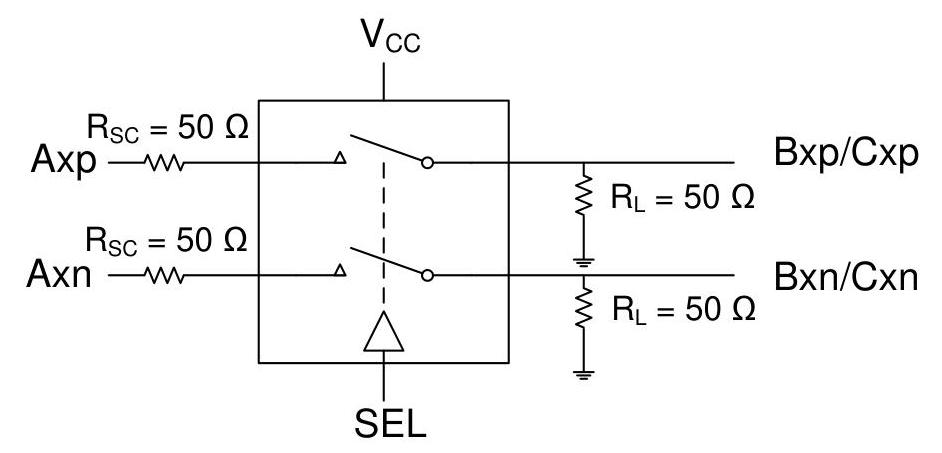

Figure 1. Test Setup
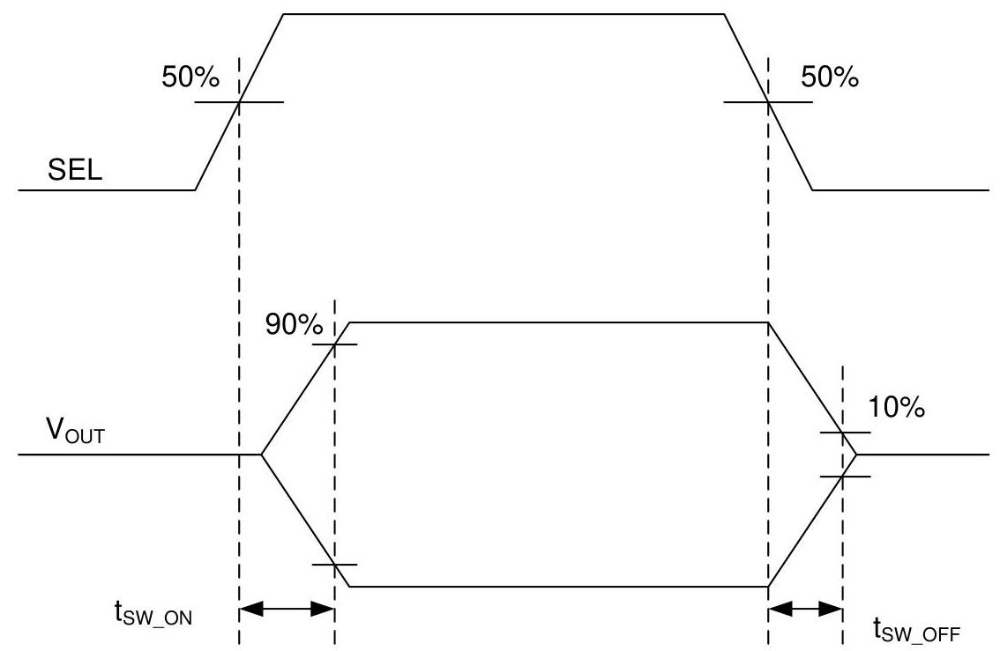

Figure 2. Switch On and Off Timing DiagramParameter Measurement Information (continued)
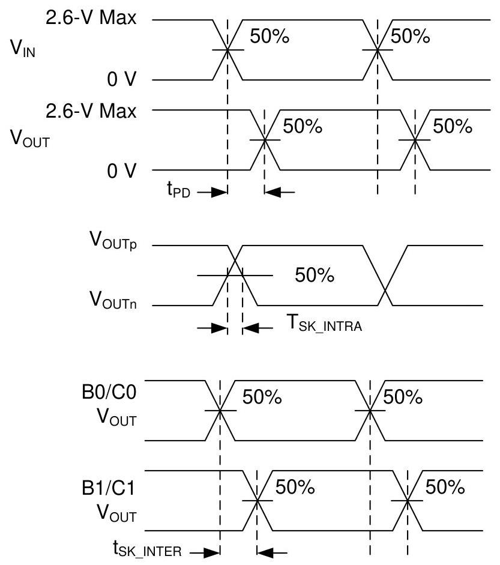

Figure 3. Timing Diagrams and Test Setup# 9 Detailed Description 

### 9.1 Overview

The HD3SS3212 is a generic analog differential passive switch that can work for any high-speed interface applications requiring a common mode voltage range of 0 to 2 V and differential signaling with differential amplitude up to 1800 mVpp . It employs adaptive tracking that ensures the channel remains unchanged for the entire common mode voltage range.
Excellent dynamic characteristics of the device allow high-speed switching with minimum attenuation to the signal eye diagram with very little added jitter. It consumes $<2 \mathrm{~mW}$ of power when operational and has a shutdown mode exercisable by OEn pin resulting $<20 \mu \mathrm{~W}$.

### 9.2 Functional Block Diagram

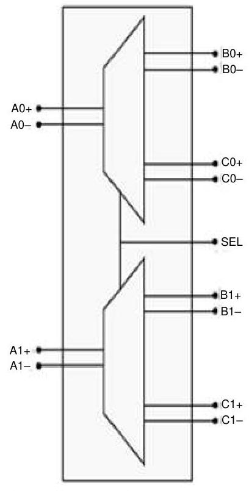

Copyright © 2016, Texas Instruments Incorporated

### 9.3 Feature Description

### 9.3.1 Output Enable and Power Savings

The HD3SS3212 has two power modes, active/normal operating mode and standby/shutdown mode. During standby mode, the device consumes very-little current to save the maximum power. To enter standby mode, the OEn control pin is pulled high through a resistor and must remain high. For active/normal operation, the OEn control pin should be pulled low to GND or dynamically controlled to switch between H or L .
HD3SS3212 consumes $<2 \mathrm{~mW}$ of power when operational and has a shutdown mode exercisable by the EN pin resulting $<20 \mu \mathrm{~W}$.# 9.4 Device Functional Modes 

Table 1. Port Select Control Logic ${ }^{(1)}$

| PORT A CHANNEL | PORT B OR PORT C CHANNEL CONNECTED TO PORT A CHANNEL |  |
| :--: | :--: | :--: |
|  | SEL $=\mathbf{L}$ | SEL $=\mathbf{H}$ |
| A0p | B0p | C0p |
| A0n | B0n | C0n |
| A1p | B1p | C1p |
| A1n | B1n | C1n |

(1) The HD3SS3212 can tolerate polarity inversions for all differential signals on Ports A, B, and C. Take care to ensure the same polarity is maintained on Port A versus Ports B/C.# 10 Application and Implementation 

## NOTE

Information in the following applications sections is not part of the TI component specification, and TI does not warrant its accuracy or completeness. TI's customers are responsible for determining suitability of components for their purposes. Customers should validate and test their design implementation to confirm system functionality.

### 10.1 Application Information

The HD3SS3212 is a generic 2-channel high-speed mux/demux type of switch that can be used for routing highspeed signals between two different locations on a circuit board. The HD3SS3212 supports several high-speed data protocols with a differential amplitude of $<1800 \mathrm{mVpp}$ and a common mode voltage of $<2.0 \mathrm{~V}$, as with USB 3.0 and DisplayPort 1.2. The device's one select input (SEL) pin can easily be controlled by an available GPIO pin within a system or from a microcontroller.
The HD3SS3212 with its adaptive common mode tracking technology can support applications where the common mode is different between the RX and TX pair. The two USB3.1 Type C connector applications show both a host and device side. The cable between the two connectors swivels the pairs to properly route the signals to the correct pin. The other applications are more generic because different connectors can be used.
Many interfaces require AC coupling between the transmitter and receiver. The 0402 capacitors are the preferred option to provide AC coupling; 0603 size capacitors also work. Avoid the 0805 size capacitors and C-packs. When placing AC coupling capacitors, symmetric placement is best. A capacitor value of $0.1 \mu \mathrm{~F}$ is best, and the value should match for the $\pm$ signal pair. The designer should place them along the TX pairs on the system board, which are usually routed on the top layer of the board.
The AC coupling capacitors have several placement options. Because the switch requires a bias voltage, the designer must place the capacitors on one side of the switch. If they are placed on both sides of the switch, a biasing voltage should be provided. Figure 4 shows a few placement options. The coupling capacitors are placed between the switch and endpoint. In this situation, the switch is biased by the system/host controller.
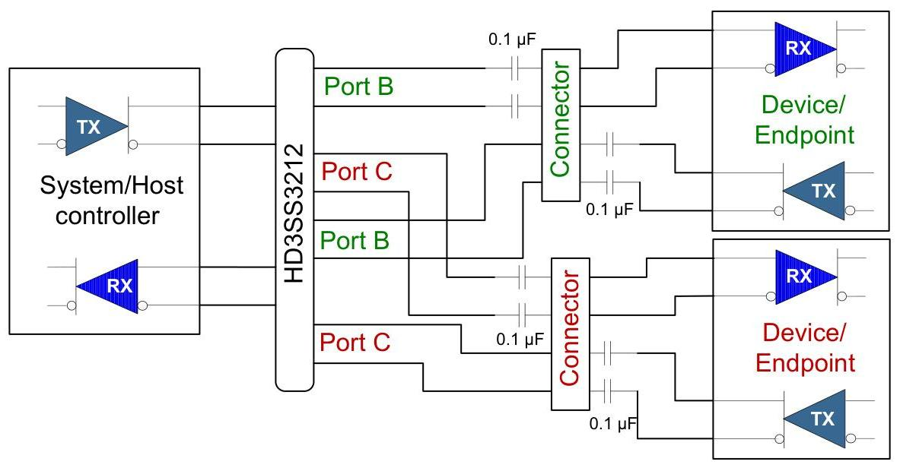

Figure 4. AC Coupling Capacitors between Switch TX and Endpoint TX

In Figure 5, the coupling capacitors are placed on the host transmit pair and endpoint transmit pair. In this situation, the switch on top is biased by the endpoint and the lower switch is biased by the host controller.# Application Information (continued) 

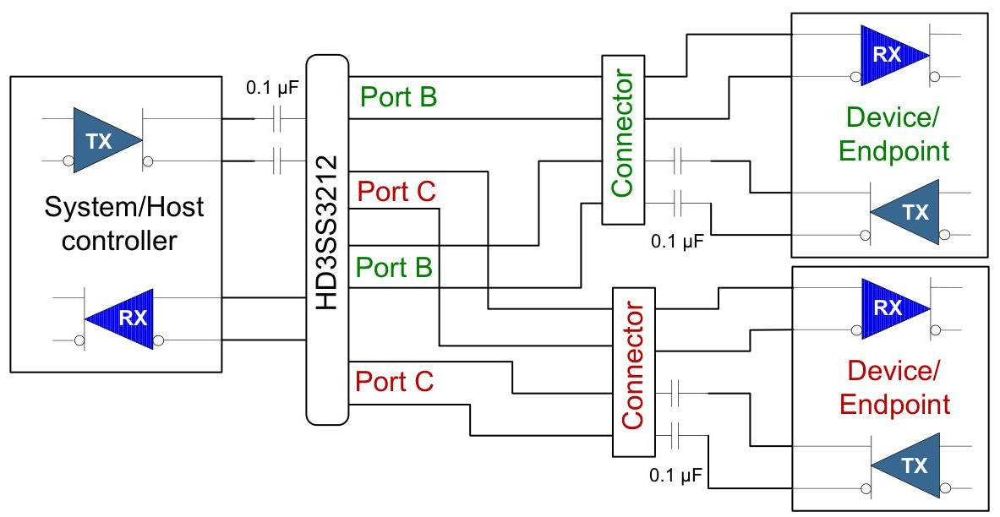

Figure 5. AC Coupling Capacitors on Host TX and Endpoint TX
In the case where the common mode voltage in the system is higher than 2 V , the coupling capacitors are placed on both sides of the switch (shown in Figure 6). A biasing voltage of $<2 \mathrm{~V}$ is required in this case.
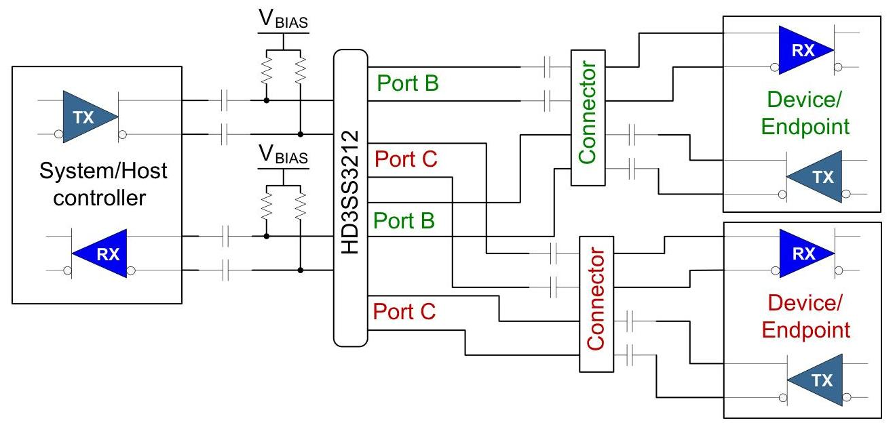
$\mathrm{V}_{\text {BIAS }}$ can be GND
Capacitor and resistor values depend upon application
Figure 6. AC Coupling Capacitors on Both Sides of Switch
The HD3SS3212 can be used with the USB Type C connector to support the connector's flip ability. Figure 7 provides the generic location for the AC coupling capacitors for this application.Application Information (continued)
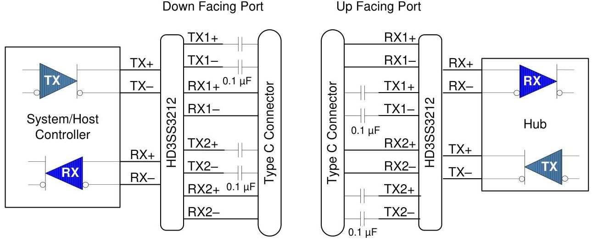

Figure 7. AC Coupling Capacitors for USB Type C# 10.2 Typical Applications 

### 10.2.1 Down Facing Port for USB3.1 Type C

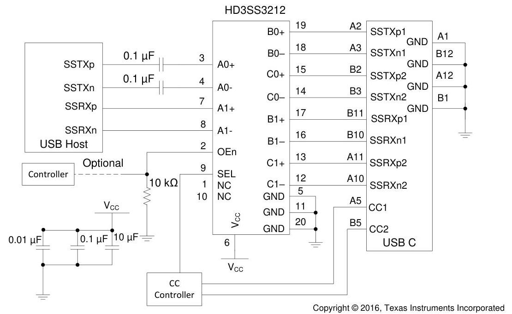

Figure 8. Down Facing Port for USB3.1 Type C Connector

### 10.2.1.1 Design Requirements

The HD3SS3212 can be designed into many different applications. All the applications have certain requirements for the system to work properly. The HD3SS3212 requires $3.3-\mathrm{V} \pm 10 \% \mathrm{~V}_{\mathrm{CC}}$ rail. The OEn pin must be low for device to work otherwise it disables the outputs. This pin can be driven by a processor. The expectation is that one side of the device has AC coupling capacitors. Table 2 provides information on expected values to perform properly.

Table 2. Design Parameters

| DESIGN PARAMETER | VALUE |
| :-- | :--: |
| $\mathrm{V}_{\mathrm{CC}}$ | 3.3 V |
| AXp/n, BXp/n, CXp/n CM input voltage | 0 to 2 V |
| Control/OEn pin max voltage for low | 0.8 V |
| Control/OEn pin min voltage for high | 2.0 V |
| AC coupling capacitor | 100 nF |
| $\mathrm{R}_{\text {BIAS }}$ (Figure 8) when needed | $1 \mathrm{k} \Omega$ |

### 10.2.1.2 Detailed Design Procedure

The HD3SS3212 is a high-speed passive switch device that can behave as a mux or demux. Because this is a passive switch, signal integrity is important because the device provides no signal conditioning capability. The device can support 2 to 3 inches of board trace and a connector on either end.
To design in the HD3SS3212, the designer needs to understand the following.

- Determine the loss profile between circuits that are to be muxed or demuxed.
- Provide clean impedance and electrical length matched board traces.
- Depending upon the application, determine the best place to put the 100-nF coupling capacitor.
- Provide a control signal for the SEL and OEn pins.
- The thermal pad must be connected to ground.- See the application schematics on recommended decouple capacitors from $\mathrm{V}_{\mathrm{CC}}$ pins to ground

# 10.2.1.3 Application Curves 

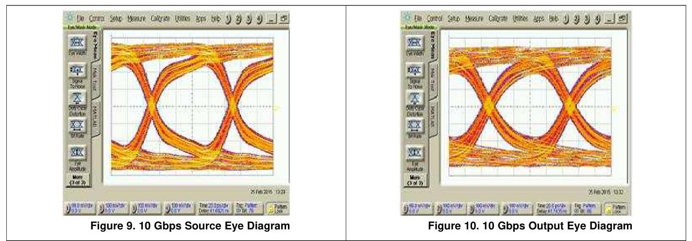

### 10.3 Systems Examples

### 10.3.1 Up Facing Port for USB3.1 Type C

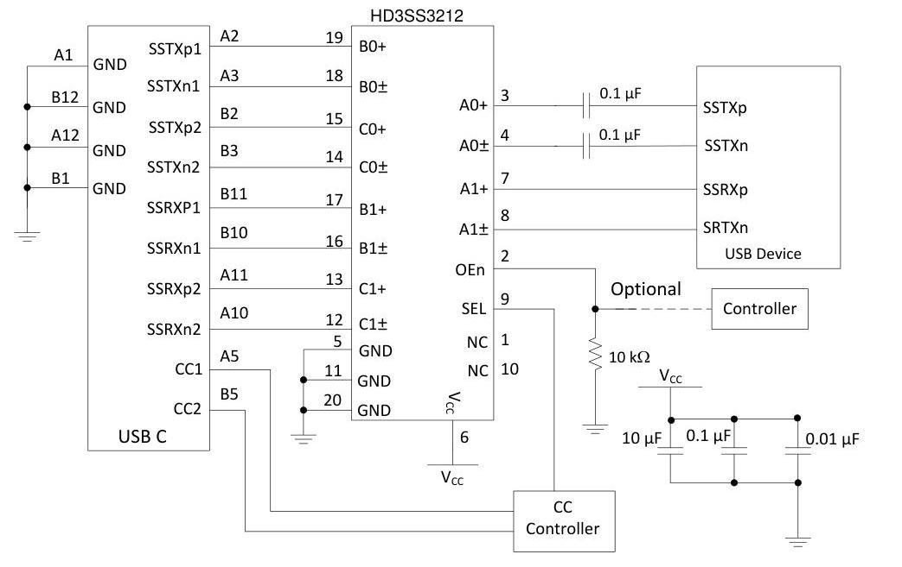

Figure 11. Up Facing Port for USB3.1 USB Type-C Connector# Systems Examples (continued) 

### 10.3.2 PCIE/SATA/USB

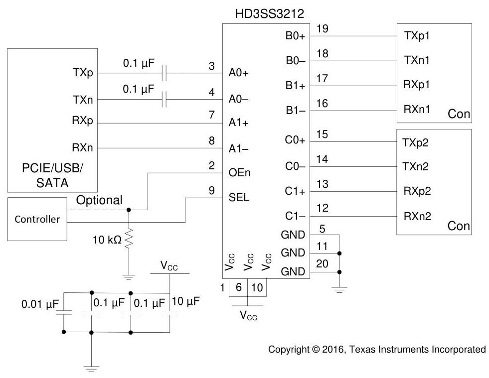

Figure 12. PCIE Motherboard

### 10.3.3 PCIE/eSATA

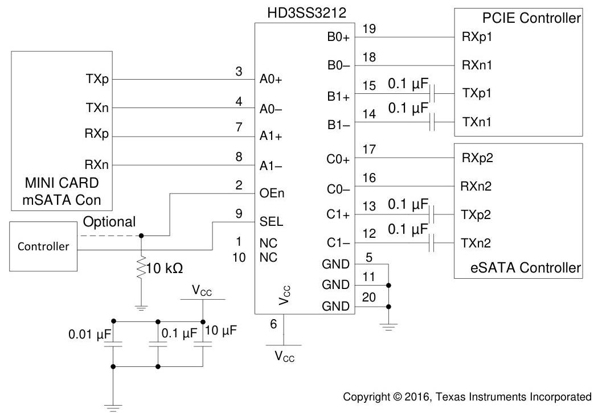

Figure 13. PCIE and eSATA Combo# Systems Examples (continued) 

### 10.3.4 USB/eSATA

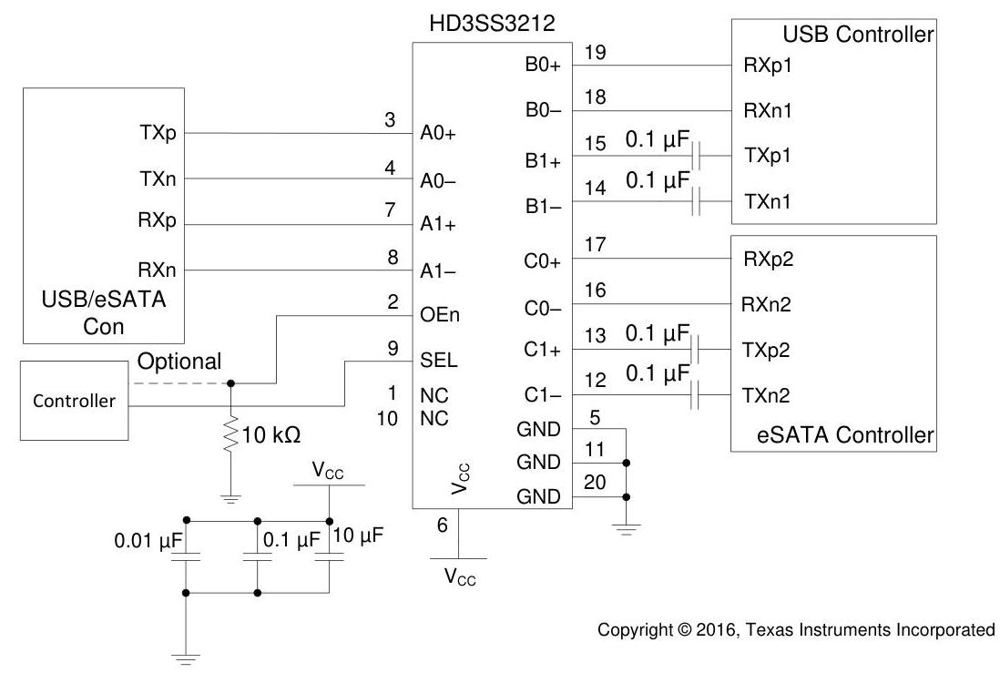

Figure 14. eSATA and USB 3.0 Combo Connector

### 10.3.5 MIPI Camera Serial Interface

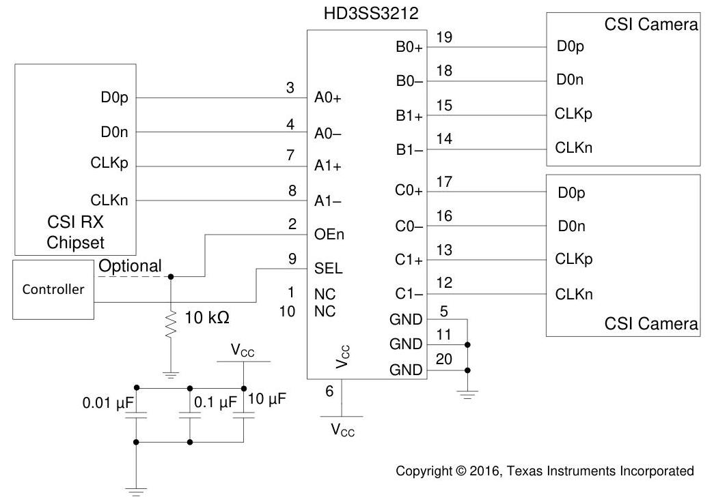

Figure 15. CSI Camera Array# 11 Power Supply Recommendations 

The HD3SS3212 does not require a power supply sequence. However, TI recommends that OEn is asserted low after device supply $\mathrm{V}_{\mathrm{CC}}$ is stable and in specification. TI also recommends to place ample decoupling capacitors at the device $\mathrm{V}_{\mathrm{CC}}$ near the pin.

## 12 Layout

### 12.1 Layout Guidelines

On a high-K board, TI always recommends to solder the PowerPAD ${ }^{\text {TM }}$ onto the thermal land. A thermal land is the area of solder-tinned-copper underneath the PowerPAD package. On a high-K board, the HD3SS3212 can operate over the full temperature range by soldering the PowerPAD onto the thermal land without vias.
On a low-K board, for the device to operate across the temperature range, the designer must use a 1-oz Cu trace connecting the GND pins to the thermal land. A general PCB design guide for PowerPAD packages is provided in PowerPAD Thermally-Enhanced Package, SLMA002.

### 12.2 Layout Example

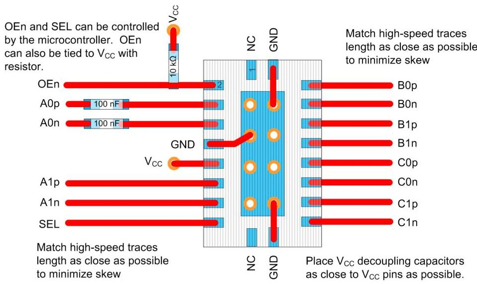

Figure 16. HD3SS3212 Basic Layout Example for Application Shown in Down Facing Port for USB3.1 Type C# 13 Device and Documentation Support 

### 13.1 Related Links

The table below lists quick access links. Categories include technical documents, support and community resources, tools and software, and quick access to sample or buy.

Table 3. Related Links

| PARTS | PRODUCT FOLDER | SAMPLE \& BUY | TECHNICAL   DOCUMENTS | TOOLS \&   SOFTWARE | SUPPORT \&   COMMUNITY |
| :--: | :--: | :--: | :--: | :--: | :--: |
| HD3SS3212 | Click here | Click here | Click here | Click here | Click here |
| HD3SS3212I | Click here | Click here | Click here | Click here | Click here |

### 13.2 Receiving Notification of Documentation Updates

To receive notification of documentation updates - go to the product folder for your device on ti.com. In the upper right-hand corner, click the Alert me button to register and receive a weekly digest of product information that has changed (if any). For change details, check the revision history of any revised document.

### 13.3 Community Resources

The following links connect to TI community resources. Linked contents are provided "AS IS" by the respective contributors. They do not constitute TI specifications and do not necessarily reflect TI's views; see TI's Terms of Use.
TI E2E ${ }^{\text {TM }}$ Online Community TI's Engineer-to-Engineer (E2E) Community. Created to foster collaboration among engineers. At e2e.ti.com, you can ask questions, share knowledge, explore ideas and help solve problems with fellow engineers.
Design Support TI's Design Support Quickly find helpful E2E forums along with design support tools and contact information for technical support.

### 13.4 Trademarks

PowerPAD, E2E are trademarks of Texas Instruments.
All other trademarks are the property of their respective owners.

### 13.5 Electrostatic Discharge Caution

These devices have limited built-in ESD protection. The leads should be shorted together or the device placed in conductive foam during storage or handling to prevent electrostatic damage to the MOS gates.

### 13.6 Glossary

SLYZ022 - TI Glossary.
This glossary lists and explains terms, acronyms, and definitions.

## 14 Mechanical, Packaging, and Orderable Information

The following pages include mechanical, packaging, and orderable information. This information is the most current data available for the designated devices. This data is subject to change without notice and revision of this document. For browser-based versions of this data sheet, refer to the left-hand navigation.# RKS0020A 

## PACKAGE OUTLINE

VQFN - 1 mm max height
PLASTIC QUAD FLATPACK - NO LEAD
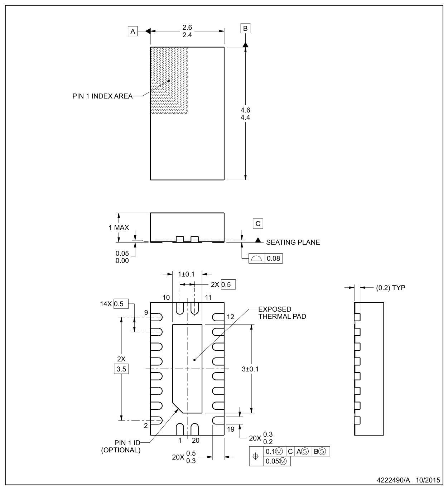

NOTES:

1. All linear dimensions are in millimeters. Any dimensions in parenthesis are for reference only. Dimensioning and tolerancing per ASME Y14.5M.
2. This drawing is subject to change without notice.
3. The package thermal pad must be soldered to the printed circuit board for thermal and mechanical performance.# EXAMPLE BOARD LAYOUT 

RKS0020A
VQFN - 1 mm max height
PLASTIC QUAD FLATPACK - NO LEAD
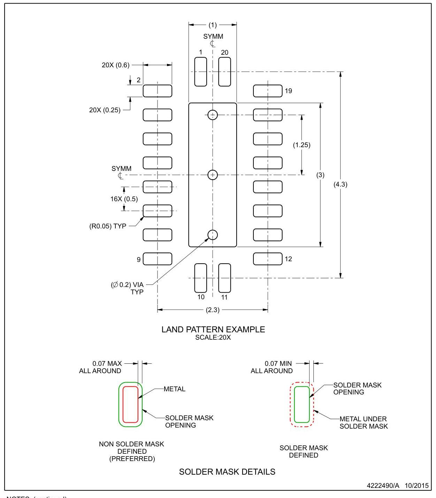

NOTES: (continued)
4. This package is designed to be soldered to a thermal pad on the board. For more information, see Texas Instruments literature number SLUA271 (www.ti.com/lit/slua271).
5. Vias are optional depending on application, refer to device data sheet. If some or all are implemented, recommended via locations are shown.# EXAMPLE STENCIL DESIGN 

RKS0020A
VQFN - 1 mm max height
PLASTIC QUAD FLATPACK - NO LEAD
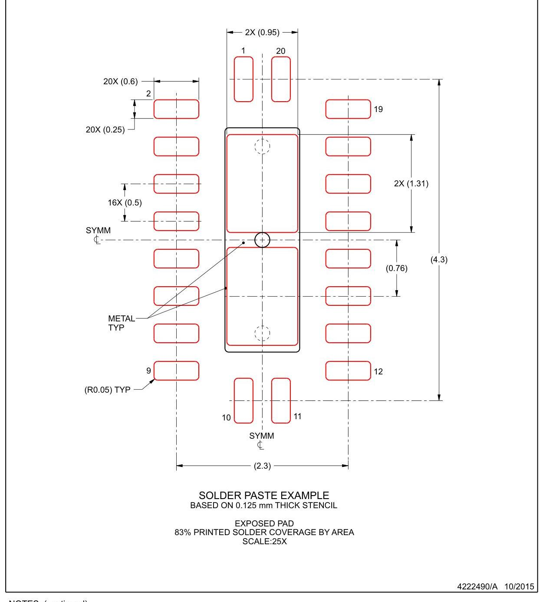

NOTES: (continued)
6. Laser cutting apertures with trapezoidal walls and rounded corners may offer better paste release. IPC-7525 may have alternate design recommendations.# PACKAGE OPTION ADDENDUM

|  Orderable part number | Status
(1) | Material type
(2) | Package | Pins | Package qty | Carrier | RoHS
(3) | Lead finish/
Ball material
(4) | MSL rating/
Peak reflow
(5) | Op temp ( ${ }^{\circ} \mathrm{C}$ ) | Part marking
(6)  |
| --- | --- | --- | --- | --- | --- | --- | --- | --- | --- | --- | --- |
|  HD3SS3212IRKSR | Active | Production | VQFN (RKS) | 20 | 3000 | LARGE T\&R | Yes | NIPDAU | Level-2-260C-1 YEAR | $-40$ to 85 | HD3212I  |
|  HD3SS3212IRKSR.B | Active | Production | VQFN (RKS) | 20 | 3000 | LARGE T\&R | Yes | NIPDAU | Level-2-260C-1 YEAR | $-40$ to 85 | HD3212I  |
|  HD3SS3212IRKSRG4 | Active | Production | VQFN (RKS) | 20 | 3000 | LARGE T\&R | Yes | NIPDAU | Level-2-260C-1 YEAR | $-40$ to 85 | HD3212I  |
|  HD3SS3212IRKSRG4.B | Active | Production | VQFN (RKS) | 20 | 3000 | LARGE T\&R | Yes | NIPDAU | Level-2-260C-1 YEAR | $-40$ to 85 | HD3212I  |
|  HD3SS3212IRKST | Active | Production | VQFN (RKS) | 20 | 250 | SMALL T\&R | Yes | NIPDAU | Level-2-260C-1 YEAR | $-40$ to 85 | HD3212I  |
|  HD3SS3212IRKST.B | Active | Production | VQFN (RKS) | 20 | 250 | SMALL T\&R | Yes | NIPDAU | Level-2-260C-1 YEAR | $-40$ to 85 | HD3212I  |
|  HD3SS3212RKSR | Active | Production | VQFN (RKS) | 20 | 3000 | LARGE T\&R | Yes | NIPDAU | Level-2-260C-1 YEAR | 0 to 70 | HDS3212  |
|  HD3SS3212RKSR.B | Active | Production | VQFN (RKS) | 20 | 3000 | LARGE T\&R | Yes | NIPDAU | Level-2-260C-1 YEAR | 0 to 70 | HDS3212  |
|  HD3SS3212RKST | Active | Production | VQFN (RKS) | 20 | 250 | SMALL T\&R | Yes | NIPDAU | Level-2-260C-1 YEAR | 0 to 70 | HDS3212  |
|  HD3SS3212RKST.B | Active | Production | VQFN (RKS) | 20 | 250 | SMALL T\&R | Yes | NIPDAU | Level-2-260C-1 YEAR | 0 to 70 | HDS3212  |

${ }^{(1)}$ Status: For more details on status, see our product life cycle. ${ }^{(2)}$ Material type: When designated, preproduction parts are prototypes/experimental devices, and are not yet approved or released for full production. Testing and final process, including without limitation quality assurance, reliability performance testing, and/or process qualification, may not yet be complete, and this item is subject to further changes or possible discontinuation. If available for ordering, purchases will be subject to an additional waiver at checkout, and are intended for early internal evaluation purposes only. These items are sold without warranties of any kind. ${ }^{(3)}$ RoHS values: Yes, No, RoHS Exempt. See the TI RoHS Statement for additional information and value definition. ${ }^{(4)}$ Lead finish/Ball material: Parts may have multiple material finish options. Finish options are separated by a vertical ruled line. Lead finish/Ball material values may wrap to two lines if the finish value exceeds the maximum column width. ${ }^{(5)}$ MSL rating/Peak reflow: The moisture sensitivity level ratings and peak solder (reflow) temperatures. In the event that a part has multiple moisture sensitivity ratings, only the lowest level per JEDEC standards is shown. Refer to the shipping label for the actual reflow temperature that will be used to mount the part to the printed circuit board. ${ }^{(6)}$ Part marking: There may be an additional marking, which relates to the logo, the lot trace code information, or the environmental category of the part.

Multiple part markings will be inside parentheses. Only one part marking contained in parentheses and separated by a "-" will appear on a part. If a line is indented then it is a continuation of the previous line and the two combined represent the entire part marking for that device.

Important Information and Disclaimer:The information provided on this page represents TI's knowledge and belief as of the date that it is provided. TI bases its knowledge and belief on information provided by third parties, and makes no representation or warranty as to the accuracy of such information. Efforts are underway to better integrate information from third parties. TI has taken and continues to take reasonable steps to provide representativeand accurate information but may not have conducted destructive testing or chemical analysis on incoming materials and chemicals. TI and TI suppliers consider certain information to be proprietary, and thus CAS numbers and other limited information may not be available for release.

In no event shall TI's liability arising out of such information exceed the total purchase price of the TI part(s) at issue in this document sold by TI to Customer on an annual basis.

# OTHER QUALIFIED VERSIONS OF HD3SS3212 : 

- Automotive : HD3SS3212-Q1

NOTE: Qualified Version Definitions:

- Automotive - Q100 devices qualified for high-reliability automotive applications targeting zero defects# TAPE AND REEL INFORMATION 

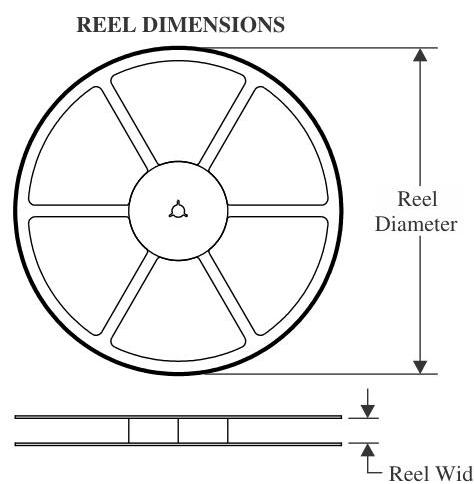

TAPE DIMENSIONS
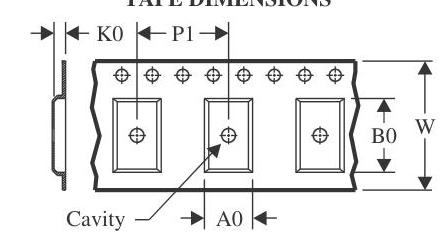

| A0 | Dimension designed to accommodate the component width |
| :-- | :-- |
| B0 | Dimension designed to accommodate the component length |
| K0 | Dimension designed to accommodate the component thickness |
| W | Overall width of the carrier tape |
| P1 | Pitch between successive cavity centers |

QUADRANT ASSIGNMENTS FOR PIN 1 ORIENTATION IN TAPE

Pocket Quadrants
*All dimensions are nominal

| Device | Package   Type | Package   Drawing | Pins | SPQ | Reel   Diameter   (mm) | Reel   Width   W1 (mm) | A0   (mm) | B0   (mm) | K0   (mm) | P1   (mm) | W   (mm) | Pin1   Quadrant |
| :--: | :--: | :--: | :--: | :--: | :--: | :--: | :--: | :--: | :--: | :--: | :--: | :--: |
| HD3SS3212IRKSR | VQFN | RKS | 20 | 3000 | 180.0 | 12.4 | 2.8 | 4.8 | 1.2 | 4.0 | 12.0 | Q1 |
| HD3SS3212IRKSRG4 | VQFN | RKS | 20 | 3000 | 180.0 | 12.4 | 2.8 | 4.8 | 1.2 | 4.0 | 12.0 | Q1 |
| HD3SS3212IRKST | VQFN | RKS | 20 | 250 | 180.0 | 12.4 | 2.8 | 4.8 | 1.2 | 4.0 | 12.0 | Q1 |
| HD3SS3212RKSR | VQFN | RKS | 20 | 3000 | 180.0 | 12.4 | 2.8 | 4.8 | 1.2 | 4.0 | 12.0 | Q1 |
| HD3SS3212RKST | VQFN | RKS | 20 | 250 | 180.0 | 12.4 | 2.8 | 4.8 | 1.2 | 4.0 | 12.0 | Q1 |# PACKAGE MATERIALS INFORMATION

## TAPE AND REEL BOX DIMENSIONS

*All dimensions are nominal

|  Device | Package Type | Package Drawing | Pins | SPQ | Length (mm) | Width (mm) | Height (mm)  |
| --- | --- | --- | --- | --- | --- | --- | --- |
|  HD3SS3212IRKSR | VQFN | RKS | 20 | 3000 | 210.0 | 185.0 | 35.0  |
|  HD3SS3212IRKSRG4 | VQFN | RKS | 20 | 3000 | 210.0 | 185.0 | 35.0  |
|  HD3SS3212IRKST | VQFN | RKS | 20 | 250 | 210.0 | 185.0 | 35.0  |
|  HD3SS3212RKSR | VQFN | RKS | 20 | 3000 | 210.0 | 185.0 | 35.0  |
|  HD3SS3212RKST | VQFN | RKS | 20 | 250 | 210.0 | 185.0 | 35.0  |# IMPORTANT NOTICE AND DISCLAIMER 

TI PROVIDES TECHNICAL AND RELIABILITY DATA (INCLUDING DATA SHEETS), DESIGN RESOURCES (INCLUDING REFERENCE DESIGNS), APPLICATION OR OTHER DESIGN ADVICE, WEB TOOLS, SAFETY INFORMATION, AND OTHER RESOURCES "AS IS" AND WITH ALL FAULTS, AND DISCLAIMS ALL WARRANTIES, EXPRESS AND IMPLIED, INCLUDING WITHOUT LIMITATION ANY IMPLIED WARRANTIES OF MERCHANTABILITY, FITNESS FOR A PARTICULAR PURPOSE OR NON-INFRINGEMENT OF THIRD PARTY INTELLECTUAL PROPERTY RIGHTS.
These resources are intended for skilled developers designing with TI products. You are solely responsible for (1) selecting the appropriate TI products for your application, (2) designing, validating and testing your application, and (3) ensuring your application meets applicable standards, and any other safety, security, regulatory or other requirements.
These resources are subject to change without notice. TI grants you permission to use these resources only for development of an application that uses the TI products described in the resource. Other reproduction and display of these resources is prohibited. No license is granted to any other TI intellectual property right or to any third party intellectual property right. TI disclaims responsibility for, and you will fully indemnify TI and its representatives against, any claims, damages, costs, losses, and liabilities arising out of your use of these resources.
TI's products are provided subject to TI's Terms of Sale or other applicable terms available either on ti.com or provided in conjunction with such TI products. TI's provision of these resources does not expand or otherwise alter TI's applicable warranties or warranty disclaimers for TI products.
TI objects to and rejects any additional or different terms you may have proposed.
Mailing Address: Texas Instruments, Post Office Box 655303, Dallas, Texas 75265
Copyright © 2025, Texas Instruments Incorporated