# TPD1E0B04 1-Channel ESD Protection Diode for USB Type-C and Antenna Protection 

## 1 Features

- IEC 61000-4-2 Level 4 (contact) ESD protection
- $\pm 8 \mathrm{kV}$ contact discharge
- $\pm 9 \mathrm{kV}$ air gap discharge
- IEC 61000-4-4 EFT protection
- 80A (5/50ns)
- IEC 61000-4-5 surge protection
- 1.7A (8/20us)
- IO capacitance: 0.13 to 0.15 pF (typical), 0.15 to 0.18 pF (maximum)
- DC breakdown voltage: 6.7V (typical)
- Ultra low leakage current: 10nA (maximum)
- Low ESD clamping voltage
- Supports high speed interfaces up to 60Gbps
- Low insertion loss: $>30 \mathrm{GHz}(-3 \mathrm{~dB}$ bandwidth)
- Industrial temperature range: $-40^{\circ} \mathrm{C}$ to $+125^{\circ} \mathrm{C}$
- Ultra-small 0201 and 0402 footprints

## 2 Applications

- End equipment
- Laptops and desktops
- Mobile and tablets
- Set-top boxes
- TV and monitors
- USB dongles
- Docking stations
- Interfaces
- USB Type-C ${ }^{\circledR}$
- Thunderbolt ${ }^{\text {TM }} 4$
- USB 4.0 and below
- HDMI ${ }^{\text {TM }} 2.1$ and below
- DisplayPort ${ }^{\text {TM }} 2.1$ and below
- PCI Express ${ }^{\circledR} 5.0$ and below
- Antenna

## 3 Description

The TPD1E0B04 is a bidirectional TVS ESD protection diode array for USB Type-C and Thunderbolt 4 circuit protection. The TPD1E0B04 is rated to dissipate ESD strikes at the maximum level specified in the IEC 61000-4-2 international standard (Level 4).

This device features a 0.13 pF IO capacitance per channel (DPL package) making it ideal for protecting high-speed interfaces up to 60 Gbps such as USB 4.0 and below, Thunderbolt 4, and Antenna. The low dynamic resistance and low clamping voltage ensure system level protection against transient events.
The TPD1E0B04 is offered in the industry standard 0201 (DPL) and 0402 (DPY) packages.

Package Information

| PART NUMBER | PACKAGE ${ }^{(1)}$ | PACKAGE SIZE ${ }^{(2)}$ |
| :-- | :-- | :-- |
| TPD1E0B04 | DPL (DFN0603, 2) | $0.60 \mathrm{~mm} \times 0.30 \mathrm{~mm}$ |
|  | DPY (DFN1006, 2) | $1.00 \mathrm{~mm} \times 0.60 \mathrm{~mm}$ |

(1) For more information, see Section 10.
(2) The package size (length $\times$ width) is a nominal value and includes pins, where applicable.

Typical Application# Table of Contents 

1 Features ..... 1
2 Applications ..... 1
3 Description ..... 1
4 Pin Configuration and Functions ..... 3
5 Specifications ..... 4
5.1 Absolute Maximum Ratings ..... 4
5.2 ESD Ratings ..... 4
5.3 ESD Ratings-IEC Specification ..... 4
5.4 Recommended Operating Conditions ..... 4
5.5 Thermal Information ..... 4
5.6 Electrical Characteristics ..... 5
5.7 Typical Characteristics ..... 6
6 Detailed Description ..... 9
6.1 Overview ..... 9
6.2 Functional Block Diagram ..... 9
6.3 Feature Description ..... 9
6.4 Device Functional Modes ..... 10
7 Application and Implementation ..... 11
7.1 Application Information ..... 11
7.2 Typical Applications ..... 11
7.3 Power Supply Recommendations ..... 15
7.4 Layout ..... 15
8 Device and Documentation Support ..... 16
8.1 Documentation Support ..... 16
8.2 Receiving Notification of Documentation Updates ..... 16
8.3 Support Resources ..... 16
8.4 Trademarks ..... 16
8.5 Electrostatic Discharge Caution ..... 16
8.6 Glossary ..... 16
9 Revision History ..... 16
10 Mechanical, Packaging, and Orderable Information ..... 17# 4 Pin Configuration and Functions 

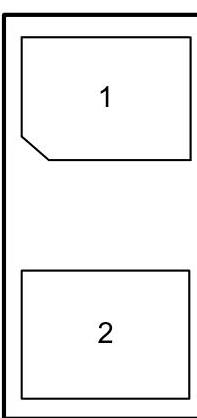

Figure 4-1. DPL Package 2-Pin X2SON Top View
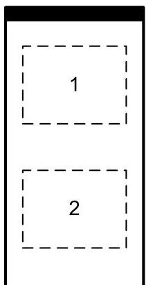

Figure 4-2. DPY Package 2-Pin X1SON Top View

| PIN |  | I/O | DESCRIPTION |
| :--: | :--: | :--: | :--: |
| NO. | NAME |  |  |
| 1 | IO | I/O | ESD Protected Channel. If used as ESD IO, connect pin 2 to ground |
| 2 | IO | I/O | ESD Protected Channel. If used as ESD IO, connect pin 1 to ground |# 5 Specifications 

### 5.1 Absolute Maximum Ratings

over operating free-air temperature range (unless otherwise noted) ${ }^{(1)}$

|  |  |  | MIN | MAX | UNIT |
| :--: | :--: | :--: | :--: | :--: | :--: |
| Electrical fast transient |  | IEC 61000-4-5 (5/50 ns) |  | 80 | A |
| Peak pulse |  | IEC 61000-4-5 power ( $t_{p}-8 / 20 \mu \mathrm{~s}$ ) |  | 15 | W |
|  |  | IEC 61000-4-5 current ( $t_{p}-8 / 20 \mu \mathrm{~s}$ ) |  | 1.7 | A |
| $T_{A}$ |  | Operating free-air temperature | $-40$ | 125 | ${ }^{\circ} \mathrm{C}$ |
| $T_{\text {stg }}$ |  | Storage temperature | $-65$ | 155 | ${ }^{\circ} \mathrm{C}$ |

(1) Operation outside the Absolute Maximum Ratings may cause permanent device damage. Absolute Maximum Ratings do not imply functional operation of the device at these or any other conditions beyond those listed under Recommended Operating Conditions. If used outside the Recommended Operating Conditions but within the Absolute Maximum Ratings, the device may not be fully functional, and this may affect device reliability, functionality, performance, and shorten the device lifetime.

### 5.2 ESD Ratings

|  |  |  | VALUE | UNIT |
| :--: | :--: | :--: | :--: | :--: |
| $\mathrm{V}_{\text {(ESD) }}$ | Electrostatic discharge | Human-body model (HBM), per ANSI/ESDA/JEDEC JS-001 ${ }^{(1)}$ | $\pm 2500$ | V |
|  |  | Charged-device model (CDM), per JEDEC specification JESD22-C101 ${ }^{(2)}$ | $\pm 1000$ |  |

(1) JEDEC document JEP155 states that 500-V HBM allows safe manufacturing with a standard ESD control process.
(2) JEDEC document JEP157 states that 250-V CDM allows safe manufacturing with a standard ESD control process.

### 5.3 ESD Ratings-IEC Specification

|  |  |  | VALUE | UNIT |
| :--: | :--: | :--: | :--: | :--: |
| $\mathrm{V}_{\text {(ESD) }}$ | Electrostatic discharge | IEC 61000-4-2 contact discharge | $\pm 8000$ | V |
|  |  | IEC 61000-4-2 air-gap discharge | $\pm 9000$ |  |

### 5.4 Recommended Operating Conditions

over operating free-air temperature range (unless otherwise noted)

|  |  | MIN | MAX | UNIT |
| :--: | :--: | :--: | :--: | :--: |
| $\mathrm{V}_{\mathrm{IO}}$ | Input pin voltage | $-3.6$ | 3.6 | V |
| $T_{A}$ | Operating free-air temperature | $-40$ | 125 | ${ }^{\circ} \mathrm{C}$ |

### 5.5 Thermal Information

| THERMAL METRIC ${ }^{(1)}$ |  | TPD1E0B04 |  | UNIT |
| :--: | :--: | :--: | :--: | :--: |
|  |  | DPL (X2SON) | DPY (X1SON) |  |
|  |  | 2 PINS | 2 PINS |  |
| $R_{8 \text { JA }}$ | Junction-to-ambient thermal resistance | 582 | 442.6 | ${ }^{\circ} \mathrm{C} / \mathrm{W}$ |
| $R_{8 \text { JC(top) }}$ | Junction-to-case (top) thermal resistance | 264.5 | 243.8 | ${ }^{\circ} \mathrm{C} / \mathrm{W}$ |
| $R_{8 \text { JB }}$ | Junction-to-board thermal resistance | 394.4 | 162.5 | ${ }^{\circ} \mathrm{C} / \mathrm{W}$ |
| $\psi_{\text {JT }}$ | Junction-to-top characterization parameter | 36.4 | 154.1 | ${ }^{\circ} \mathrm{C} / \mathrm{W}$ |
| $\psi_{\text {JB }}$ | Junction-to-board characterization parameter | 394.4 | 163.0 | ${ }^{\circ} \mathrm{C} / \mathrm{W}$ |
| $R_{8 \text { JC(bot) }}$ | Junction-to-case (bottom) thermal resistance | N/A | N/A | ${ }^{\circ} \mathrm{C} / \mathrm{W}$ |

(1) For more information about traditional and new thermal metrics, see the Semiconductor and IC Package Thermal Metrics application note..# 5.6 Electrical Characteristics 

over operating free-air temperature range (unless otherwise noted)

| PARAMETER |  | TEST CONDITIONS | MIN | TYP | MAX | UNIT |
| :--: | :--: | :--: | :--: | :--: | :--: | :--: |
| $\mathrm{V}_{\text {RWM }}$ | Reverse stand-off voltage | $I_{I O}<10 \mathrm{nA}$ | $-3.6$ |  | 3.6 | V |
| $\mathrm{V}_{\text {BRF }}$ | Breakdown voltage, IO pin to GND | Measured as the maximum voltage before device snaps back into $\mathrm{V}_{\text {HOLD }}$ voltage | 6.7 |  |  | V |
| $\mathrm{V}_{\text {BRR }}$ | Breakdown voltage, GND to IO pin | Measured as the maximum voltage before device snaps back into $\mathrm{V}_{\text {HOLD }}$ voltage | $-6.7$ |  |  | V |
| $\mathrm{V}_{\text {HOLD }}$ | Holding voltage | $\mathrm{I}_{\mathrm{IO}}=1 \mathrm{~mA}, \mathrm{~T}_{\mathrm{A}}=25^{\circ} \mathrm{C}$ | 5 | 5.7 | 6.5 | V |
| $\mathrm{V}_{\text {CLAMP }}$ | Clamping voltage | $\mathrm{I}_{\mathrm{PP}}=1 \mathrm{~A}$, TLP, from IO to GND | 7.2 |  |  | V |
|  |  | $\mathrm{I}_{\mathrm{PP}}=5 \mathrm{~A}$, TLP, from IO to GND | 10.1 |  |  |  |
|  |  | $\mathrm{I}_{\mathrm{PP}}=16 \mathrm{~A}$, TLP, from IO to GND | 19 |  |  |  |
|  |  | $\mathrm{I}_{\mathrm{PP}}=1 \mathrm{~A}$, TLP, from GND to IO | 7.2 |  |  |  |
|  |  | $\mathrm{I}_{\mathrm{PP}}=5 \mathrm{~A}$, TLP, from GND to IO | 10.1 |  |  |  |
|  |  | $\mathrm{I}_{\mathrm{PP}}=16 \mathrm{~A}$, TLP, from GND to IO | 19 |  |  |  |
| $\mathrm{I}_{\text {LEAK }}$ | Leakage current, IO to GND | $\mathrm{V}_{\mathrm{IO}}= \pm 2.5 \mathrm{~V}$ |  |  | 10 | nA |
| $R_{D Y N}$ | Dynamic resistance | IO to GND | 1 |  |  | $\Omega$ |
|  |  | GND to IO | 1 |  |  |  |
| $C_{L}$ | Line capacitance | DPL Package | $\mathrm{V}_{\mathrm{IO}}=0 \mathrm{~V}, \mathrm{f}=1 \mathrm{MHz}$, IO to GND, $\mathrm{T}_{\mathrm{A}}=$ $25^{\circ} \mathrm{C}$ | 0.13 | 0.15 | pF |
|  |  | DPY Package |  | 0.15 | 0.18 |  |# 5.7 Typical Characteristics 

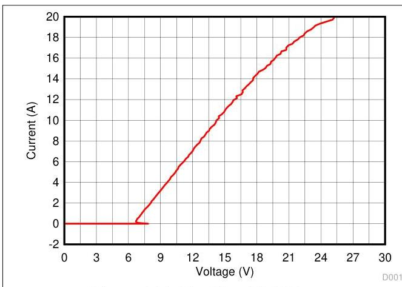

Figure 5-1. Positive TLP Curve
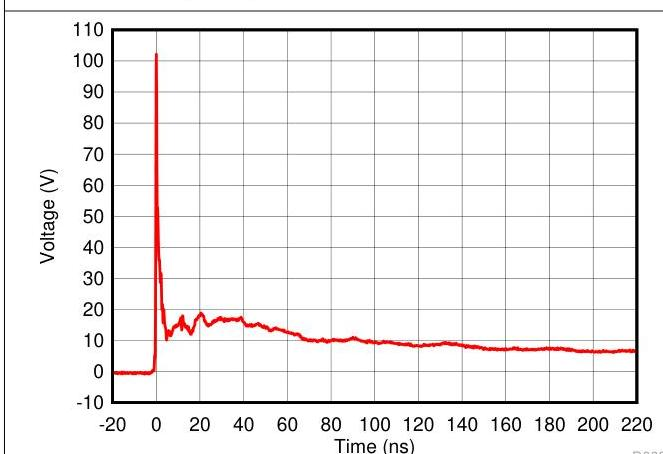

Figure 5-3. 8kV IEC Waveform
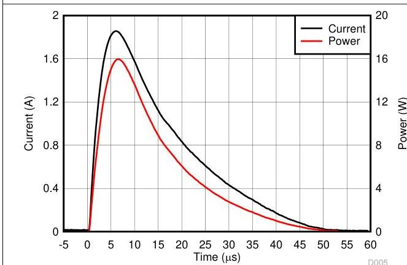

Figure 5-5. Surge Curve $\left(t_{p}=8 / 20 \mu \mathrm{~s}\right)$, IO Pin to GND
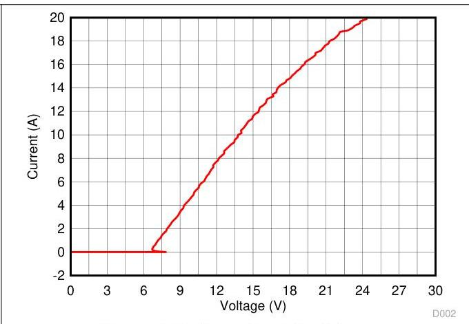

Figure 5-2. Negative TLP Curve
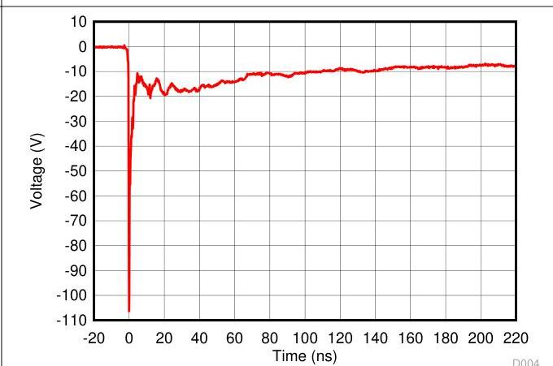

Figure 5-4. -8kV IEC Waveform
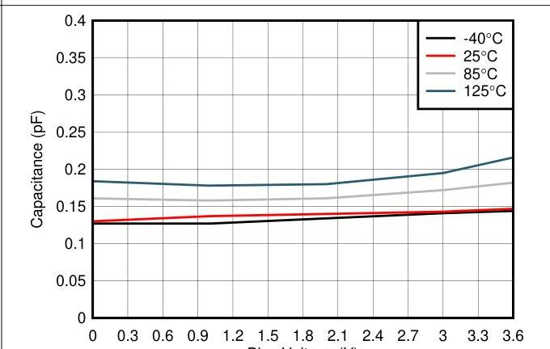

Figure 5-6. Capacitance vs Bias Voltage (DPL Package)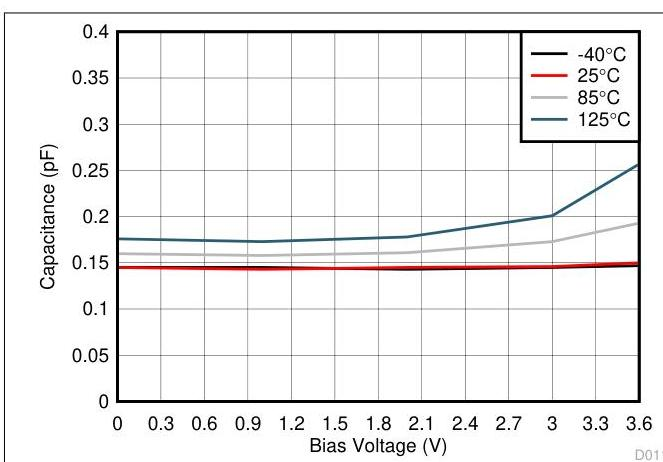

Figure 5-7. Capacitance vs Bias Voltage (DPY Package)
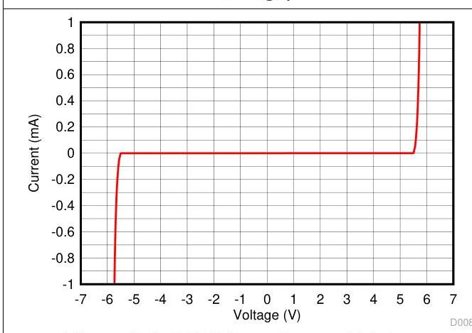

Figure 5-9. DC Voltage Sweep I-V Curve
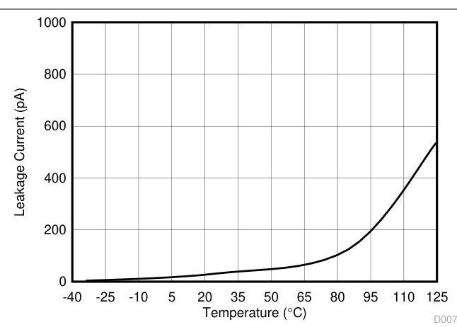

Figure 5-8. Leakage Current vs Temperature
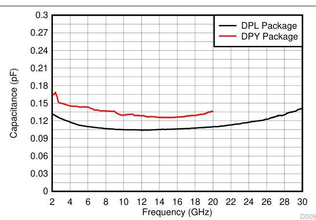

Figure 5-10. Capacitance vs Frequency
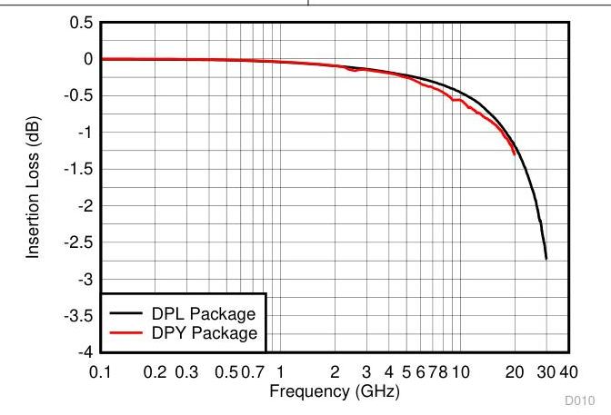

Figure 5-11. Insertion Loss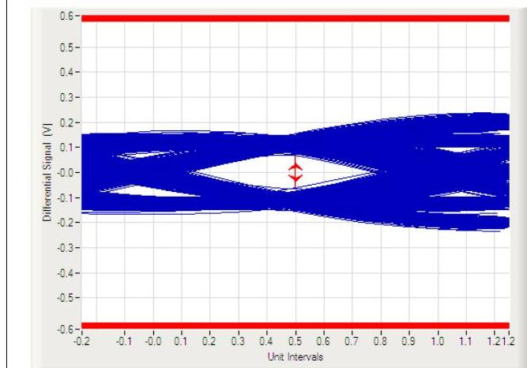

Figure 5-12. USB3.1 Gen 2 10Gbps Eye Diagram (Bare Board)
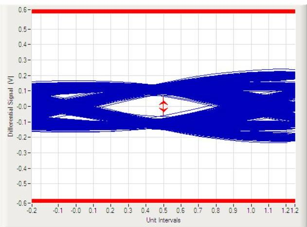

Figure 5-13. USB3.1 Gen 2 10Gbps Eye Diagram (with TPD1E0B04DPL)# 6 Detailed Description 

### 6.1 Overview

The TPD1E0B04 device is a bidirectional ESD Protection Diode with ultra-low capacitance. This device can dissipate ESD strikes at the maximum level specified by the IEC 61000-4-2 International Standard (contact). The ultra-low capacitance makes this device ideal for protecting any super high-speed signal pins including Thunderbolt 4. The low capacitance allows for extremely low losses even at RF frequencies such as USB 4.0 and below, Thunderbolt 4 , or antenna applications.

### 6.2 Functional Block Diagram

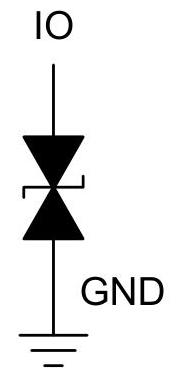

### 6.3 Feature Description

### 6.3.1 IEC 61000-4-2 ESD Protection

The I/O pins can withstand ESD events up to $\pm 8-\mathrm{kV}$ contact and $\pm 9-\mathrm{kV}$ air gap. An ESD-surge clamp diverts the current to ground.

### 6.3.2 IEC 61000-4-4 EFT Protection

The I/O pins can withstand an electrical fast transient burst of up to 80A (5/50 ns waveform, 4 kV with $50 \Omega$ impedance). An ESD-surge clamp diverts the current to ground.

### 6.3.3 IEC 61000-4-5 Surge Protection

The I/O pins can withstand surge events up to 1.7 A and 15 W ( $8 / 20 \mu \mathrm{~s}$ waveform). An ESD-surge clamp diverts this current to ground.

### 6.3.4 IO Capacitance

The capacitance between each I/O pin to ground is 0.13 pF (typical) and 0.15 pF (maximum). This device supports data rates in excess of 60 Gbps .

### 6.3.5 DC Breakdown Voltage

The DC breakdown voltage of each I/O pin is $\pm 6.7 \mathrm{~V}$ (typical). This ensures that sensitive equipment is protected from surges above the reverse standoff voltage of $\pm 3.6 \mathrm{~V}$.

### 6.3.6 Ultra Low Leakage Current

The I/O pins feature an ultra-low leakage current of 10 nA (maximum) with a bias of $\pm 2.5 \mathrm{~V}$.

### 6.3.7 Low ESD Clamping Voltage

The I/O pins feature an ESD clamp that is capable of clamping the voltage to $10.1 \mathrm{~V}\left(\mathrm{I}_{\mathrm{PP}}=5 \mathrm{~A}\right)$.

### 6.3.8 Supports High Speed Interfaces

This device is capable of supporting high speed interfaces in excess of 60 Gbps , because of the extremely low IO capacitance.# 6.3.9 Industrial Temperature Range 

This device features an industrial operating range of $-40^{\circ} \mathrm{C}$ to $+125^{\circ} \mathrm{C}$.

### 6.3.10 Industry Standard Package

The layout of this device makes it simple and easy to add protection to an existing layout. The package is offered in industry standard DFN0603 and DFN1006 footprints, requiring minimal modification to an existing layout.

### 6.4 Device Functional Modes

The TPD1E0B04 device is a passive integrated circuit that triggers when voltages are above $\mathrm{V}_{\mathrm{BRF}}$ or below $\mathrm{V}_{\mathrm{BRR}}$. During ESD events, voltages as high as $\pm 9 \mathrm{kV}$ (air) can be directed to ground through the internal diode network. When the voltages on the protected line fall below the trigger levels of TPD1E0B04 (usually within 10s of nanoseconds) the device reverts to passive.# 7 Application and Implementation 

## Note

Information in the following applications sections is not part of the TI component specification, and TI does not warrant its accuracy or completeness. TI's customers are responsible for determining suitability of components for their purposes. Customers should validate and test their design implementation to confirm system functionality.

### 7.1 Application Information

The TPD1E0B04 is a diode type TVS which is used to provide a path to ground for dissipating ESD events on high-speed signal lines between a human interface connector and a system. As the current from ESD passes through the TVS, only a small voltage drop is present across the diode. This is the voltage presented to the protected IC. The low $R_{D Y N}$ of the triggered TVS holds this voltage, $V_{\text {CLAMP }}$, to a safe level for the protected IC.

### 7.2 Typical Applications

### 7.2.1 USB Type-C Application

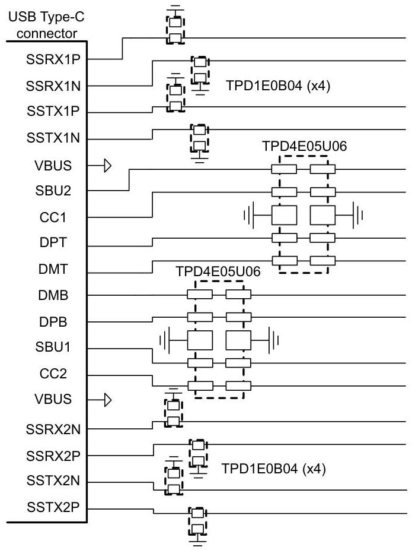

Figure 7-1. USB Type-C for Thunderbolt 3 ESD Schematic# 7.2.1.1 Design Requirements 

For this design example eight TPD1E0B04 devices and two TPD4E05U06 devices are being used in a USB Type-C for Thunderbolt 3 application. This provides a complete ESD protection scheme.
Given the Thunderbolt 3 application, the parameters listed in Table 7-1 are known.
Table 7-1. Design Parameters

| DESIGN PARAMETER | VALUE |
| :--: | :--: |
| Signal range on superspeed Lines | 0 V to 3.6 V |
| Operating frequency on superspeed Lines | up to 10 GHz |
| Signal range on CC, SBU, and DP/DM Lines | 0 V to 5 V |
| Operating frequency on CC, SBU, and DP/DM Lines | up to 480 MHz |

### 7.2.1.2 Detailed Design Procedure

### 7.2.1.2.1 Signal Range

The TPD1E0B04 supports signal ranges between -3.6 V and 3.6 V , which supports the SuperSpeed pairs on the USB Type-C application. The TPD4E05U06 supports signal ranges between 0 V and 5.5 V , which supports the CC, SBU, and DP-DM lines.

### 7.2.1.2.2 Operating Frequency

The TPD1E0B04 has a 0.13 pF (typical) capacitance, which supports the Thunderbolt 3 data rates of 20Gbps. The TPD4E05U06 has a 0.5 pF (typical) capacitance, which easily supports the CC, SBU, and DP-DM data rates.7.2.1.3 Application Curves
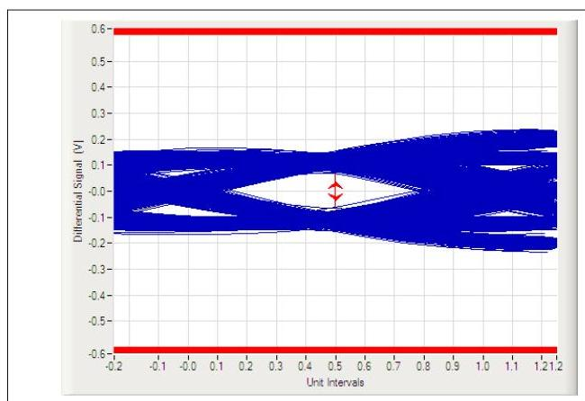

Figure 7-2. USB 3.1 Gen 2 10Gbps Eye Diagram (Bare Board)
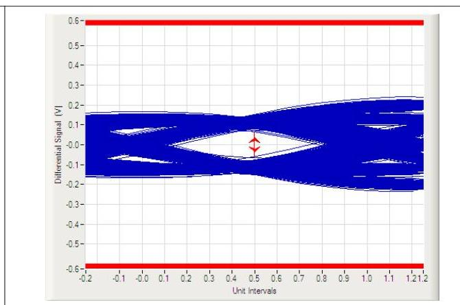

Figure 7-3. USB 3.1 Gen 2 10Gbps Eye Diagram (with TPD1E0B04DPL)
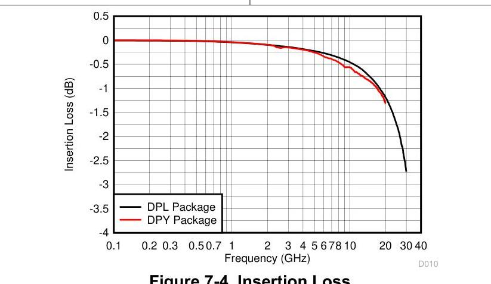

Figure 7-4. Insertion Loss

# 7.2.2 WiFi ${ }^{\circledR}$ Antenna Application 

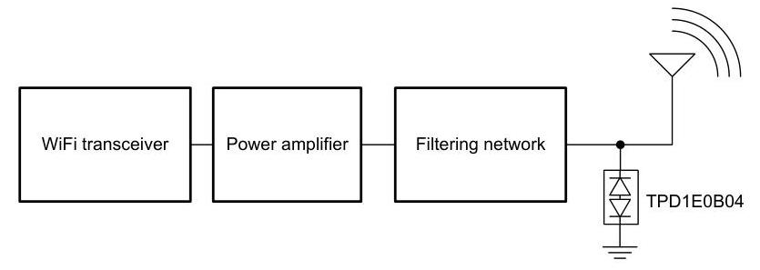

Figure 7-5. WiFi Antenna Schematic# 7.2.2.1 Design Requirements 

This design example is one TPD1E0B04 device for a 5 GHz WiFi antenna application. This provides a complete ESD protection scheme.

Given the WiFi antenna application, the parameters listed in Table 7-2 are known.
Table 7-2. Design Parameters

| DESIGN PARAMETER | VALUE |
| :--: | :--: |
| Signal range | -3.16 V to +3.16 V |
| Operating frequency | 5.170 GHz to 5.835 GHz |

### 7.2.2.2 Detailed Design Procedure

### 7.2.2.2.1 Signal Range

The TPD1E0B04 supports signal ranges between -3.6 V and 3.6 V , which supports the antenna signal range. The signal range shown assumes maximum transmit power of 200 mW into a $50 \Omega$ antenna.

### 7.2.2.2.2 Operating Frequency

The TPD1E0B04 has a 0.13 pF (typical) capacitance, which supports extremely high data rates. The capacitance versus frequency and bias voltages are exceedingly low, allowing for very low RF loss and known impedance characteristics. Since capacitance and loss changes very little across the operating frequencies, there must be minimal disturbance on the line.

### 7.2.2.3 Application Curves

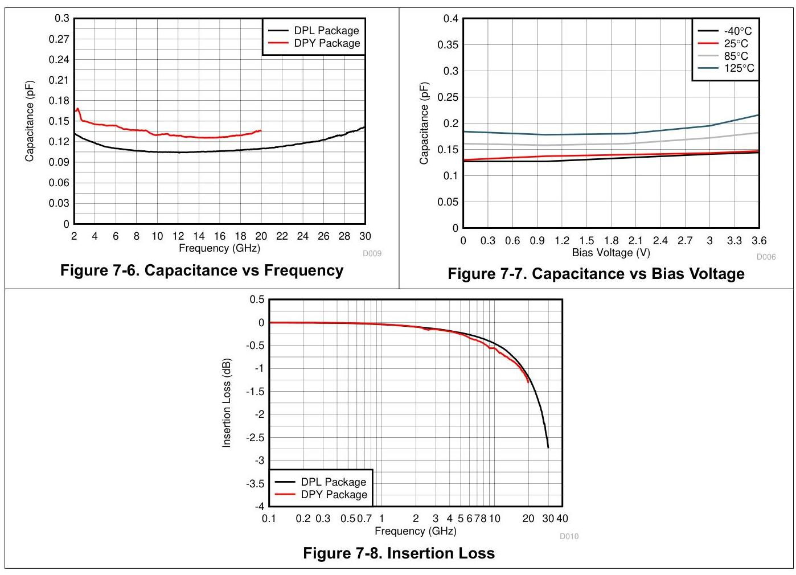# 7.3 Power Supply Recommendations 

This device is a passive ESD device so there is no need to power it. Take care not to violate the recommended I/O specification to ensure the device functions properly.

### 7.4 Layout

### 7.4.1 Layout Guidelines

- The optimum placement is as close to the connector as possible.
- EMI during an ESD event can couple from the trace being struck to other nearby unprotected traces, resulting in early system failures.
- The PCB designer must minimize the possibility of EMI coupling by keeping any unprotected traces away from the protected traces which are between the TVS and the connector.
- Route the protected traces as straight as possible.
- Eliminate any sharp corners on the protected traces between the TVS and the connector by using rounded corners with the largest radii possible.
- Electric fields tend to build up on corners, increasing EMI coupling.

### 7.4.2 Layout Example

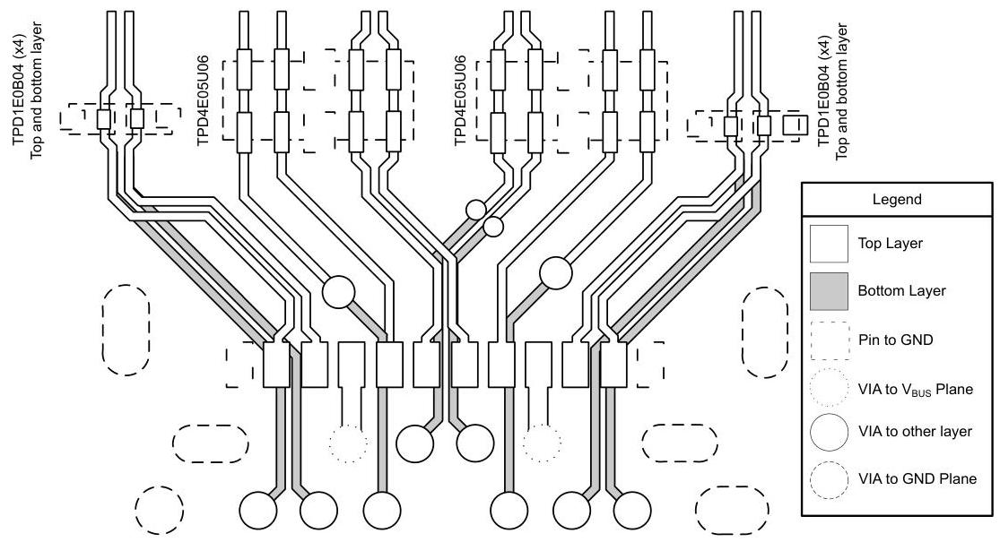

Figure 7-9. USB Type-C Mid-Mount, Hybrid Connector ESD Layout# 8 Device and Documentation Support 

### 8.1 Documentation Support

### 8.1.1 Related Documentation

For related documentation see the following:
Texas Instruments, TPD1E0B04 Evaluation Module user's guide

### 8.2 Receiving Notification of Documentation Updates

To receive notification of documentation updates, navigate to the device product folder on ti.com. In the upper right corner, click on Alert me to register and receive a weekly digest of any product information that has changed. For change details, review the revision history included in any revised document.

### 8.3 Support Resources

TI E2E ${ }^{\text {TM }}$ support forums are an engineer's go-to source for fast, verified answers and design help - straight from the experts. Search existing answers or ask your own question to get the quick design help you need.
Linked content is provided "AS IS" by the respective contributors. They do not constitute TI specifications and do not necessarily reflect TI's views; see TI's Terms of Use.

### 8.4 Trademarks

Thunderbolt ${ }^{\text {TM }}$ is a trademark of Intel Corporation.
HDMI ${ }^{\text {TM }}$ is a trademark of HDMI Licensing LLC.
DisplayPort ${ }^{\text {TM }}$ is a trademark of VESA.
TI E2E ${ }^{\text {TM }}$ is a trademark of Texas Instruments.
USB Type-C ${ }^{\circledR}$ is a registered trademark of USB Implementers Forum.
PCI Express ${ }^{\circledR}$ is a registered trademark of PCI-SIG.
WiFi ${ }^{\circledR}$ is a registered trademark of Wi-Fi Alliance.
All trademarks are the property of their respective owners.

### 8.5 Electrostatic Discharge Caution

This integrated circuit can be damaged by ESD. Texas Instruments recommends that all integrated circuits be handled with appropriate precautions. Failure to observe proper handling and installation procedures can cause damage.
ESD damage can range from subtle performance degradation to complete device failure. Precision integrated circuits may be more susceptible to damage because very small parametric changes could cause the device not to meet its published specifications.

### 8.6 Glossary

TI Glossary This glossary lists and explains terms, acronyms, and definitions.

## 9 Revision History

NOTE: Page numbers for previous revisions may differ from page numbers in the current version.
Changes from Revision B (December 2016) to Revision C (June 2025) Page

- Updated the numbering format for tables, figures, and cross-references throughout the document............... 1
- Updated data rate from 20Gbps to 60Gbps................................................................................................. 1
- Updated Interfaces supported................................................................................................................. 1

Changes from Revision A (June 2016) to Revision B (December 2016)
Page

- Added "and 0402 (DPY) packages." to the Description, and package "X1SON (2)" to the Device Information table............................................................................................................................................................... 1
- Changed the DPY Package From: Preview To Production ................................................................................. 3- Added the DPY (X1SON) package to the Thermal Information table. ..... 4
- Added DPY values to $\mathrm{C}_{\mathrm{L}}$ Line capacitance in the Electrical Characteristics table ..... 5
- Added "(DPL Package)" to the title of Figure 5-6 ..... 6
- Added Figure 5-7 ..... 6
- Added curves for the DPY package to Figure 5-10 and Figure 5-11 ..... 6
- Added curve for the DPY package to Figure 7-4 ..... 13
- Added curve for the DPY package to Figure 7-6 ..... 14
- Added curve for the DPY package to Figure 7-8 ..... 14
Changes from Revision * (March 2016) to Revision A (June 2016) ..... Page
- Changed device status from Product Preview to Production Data ..... 1

# 10 Mechanical, Packaging, and Orderable Information 

The following pages include mechanical, packaging, and orderable information. This information is the most current data available for the designated devices. This data is subject to change without notice and revision of this document. For browser-based versions of this data sheet, refer to the left-hand navigation.# PACKAGE OPTION ADDENDUM

|  Orderable part number | Status
(1) | Material type
(2) | Package | Pins | Package qty | Carrier | RoHS
(3) | Lead finish/
Ball material
(4) | MSL rating/
Peak reflow
(5) | Op temp ( ${ }^{\circ} \mathrm{C}$ ) | Part marking
(6)  |
| --- | --- | --- | --- | --- | --- | --- | --- | --- | --- | --- | --- |
|  TPD1E0B04DPLR | Active | Production | X2SON (DPL) | 2 | 15000 | LARGE T\&R | Yes | NIPDAU | Level-1-260C-UNLIM | $-40$ to 125 | 8  |
|  TPD1E0B04DPLR.B | Active | Production | X2SON (DPL) | 2 | 15000 | LARGE T\&R | Yes | NIPDAU | Level-1-260C-UNLIM | $-40$ to 125 | 8  |
|  TPD1E0B04DPLRG4 | Active | Production | X2SON (DPL) | 2 | 15000 | LARGE T\&R | Yes | NIPDAU | Level-1-260C-UNLIM | $-40$ to 125 | 8  |
|  TPD1E0B04DPLRG4.B | Active | Production | X2SON (DPL) | 2 | 15000 | LARGE T\&R | Yes | NIPDAU | Level-1-260C-UNLIM | $-40$ to 125 | 8  |
|  TPD1E0B04DPLT | Active | Production | X2SON (DPL) | 2 | 250 | SMALL T\&R | Yes | NIPDAU | Level-1-260C-UNLIM | $-40$ to 125 | 8  |
|  TPD1E0B04DPLT.B | Active | Production | X2SON (DPL) | 2 | 250 | SMALL T\&R | Yes | NIPDAU | Level-1-260C-UNLIM | $-40$ to 125 | 8  |
|  TPD1E0B04DPYR | Active | Production | X1SON (DPY) | 2 | 10000 | LARGE T\&R | Yes | NIPDAU | NIPDAUAG | Level-1-260C-UNLIM | $-40$ to 125  |
|  TPD1E0B04DPYR.B | Active | Production | X1SON (DPY) | 2 | 10000 | LARGE T\&R | Yes | NIPDAU | Level-1-260C-UNLIM | $-40$ to 125 | 5D  |
|  TPD1E0B04DPYRG4 | Active | Production | X1SON (DPY) | 2 | 10000 | LARGE T\&R | Yes | NIPDAU | Level-1-260C-UNLIM | $-40$ to 125 | 5D  |
|  TPD1E0B04DPYRG4.B | Active | Production | X1SON (DPY) | 2 | 10000 | LARGE T\&R | Yes | NIPDAU | Level-1-260C-UNLIM | $-40$ to 125 | 5D  |
|  TPD1E0B04DPYT | Active | Production | X1SON (DPY) | 2 | 250 | SMALL T\&R | Yes | NIPDAU | NIPDAUAG | Level-1-260C-UNLIM | $-40$ to 125  |
|  TPD1E0B04DPYT.B | Active | Production | X1SON (DPY) | 2 | 250 | SMALL T\&R | Yes | NIPDAU | Level-1-260C-UNLIM | $-40$ to 125 | 5D  |

${ }^{(1)}$ Status: For more details on status, see our product life cycle. ${ }^{(2)}$ Material type: When designated, preproduction parts are prototypes/experimental devices, and are not yet approved or released for full production. Testing and final process, including without limitation quality assurance, reliability performance testing, and/or process qualification, may not yet be complete, and this item is subject to further changes or possible discontinuation. If available for ordering, purchases will be subject to an additional waiver at checkout, and are intended for early internal evaluation purposes only. These items are sold without warranties of any kind. ${ }^{(3)}$ RoHS values: Yes, No, RoHS Exempt. See the TI RoHS Statement for additional information and value definition. ${ }^{(4)}$ Lead finish/Ball material: Parts may have multiple material finish options. Finish options are separated by a vertical ruled line. Lead finish/Ball material values may wrap to two lines if the finish value exceeds the maximum column width. ${ }^{(5)}$ MSL rating/Peak reflow: The moisture sensitivity level ratings and peak solder (reflow) temperatures. In the event that a part has multiple moisture sensitivity ratings, only the lowest level per JEDEC standards is shown. Refer to the shipping label for the actual reflow temperature that will be used to mount the part to the printed circuit board. ${ }^{(6)}$ Part marking: There may be an additional marking, which relates to the logo, the lot trace code information, or the environmental category of the part.

Multiple part markings will be inside parentheses. Only one part marking contained in parentheses and separated by a "-" will appear on a part. If a line is indented then it is a continuation of the previous line and the two combined represent the entire part marking for that device.Important Information and Disclaimer:The information provided on this page represents TI's knowledge and belief as of the date that it is provided. TI bases its knowledge and belief on information provided by third parties, and makes no representation or warranty as to the accuracy of such information. Efforts are underway to better integrate information from third parties. TI has taken and continues to take reasonable steps to provide representative and accurate information but may not have conducted destructive testing or chemical analysis on incoming materials and chemicals. TI and TI suppliers consider certain information to be proprietary, and thus CAS numbers and other limited information may not be available for release.

In no event shall TI's liability arising out of such information exceed the total purchase price of the TI part(s) at issue in this document sold by TI to Customer on an annual basis.# TAPE AND REEL INFORMATION 

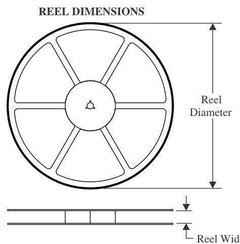

TAPE DIMENSIONS
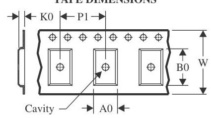

| A0 | Dimension designed to accommodate the component width |
| :-- | :-- |
| B0 | Dimension designed to accommodate the component length |
| K0 | Dimension designed to accommodate the component thickness |
| W | Overall width of the carrier tape |
| P1 | Pitch between successive cavity centers |

QUADRANT ASSIGNMENTS FOR PIN 1 ORIENTATION IN TAPE
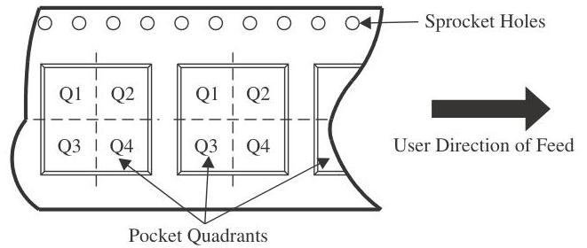

Pocket Quadrants
*All dimensions are nominal

| Device | Package   Type | Package   Drawing | Pins | SPQ | Reel   Diameter   (mm) | Reel   Width   W1 (mm) | A0   (mm) | B0   (mm) | K0   (mm) | P1   (mm) | W   (mm) | Pin1   Quadrant |
| :--: | :--: | :--: | :--: | :--: | :--: | :--: | :--: | :--: | :--: | :--: | :--: | :--: |
| TPD1E0B04DPLR | X2SON | DPL | 2 | 15000 | 178.0 | 8.4 | 0.36 | 0.66 | 0.33 | 2.0 | 8.0 | Q1 |
| TPD1E0B04DPLRG4 | X2SON | DPL | 2 | 15000 | 178.0 | 8.4 | 0.36 | 0.66 | 0.33 | 2.0 | 8.0 | Q1 |
| TPD1E0B04DPLT | X2SON | DPL | 2 | 250 | 178.0 | 8.4 | 0.36 | 0.66 | 0.33 | 2.0 | 8.0 | Q1 |
| TPD1E0B04DPYR | X1SON | DPY | 2 | 10000 | 180.0 | 8.4 | 0.67 | 1.15 | 0.46 | 2.0 | 8.0 | Q2 |
| TPD1E0B04DPYRG4 | X1SON | DPY | 2 | 10000 | 180.0 | 8.4 | 0.67 | 1.15 | 0.46 | 2.0 | 8.0 | Q2 |
| TPD1E0B04DPYT | X1SON | DPY | 2 | 250 | 180.0 | 8.4 | 0.67 | 1.15 | 0.46 | 2.0 | 8.0 | Q2 |# PACKAGE MATERIALS INFORMATION

## TAPE AND REEL BOX DIMENSIONS

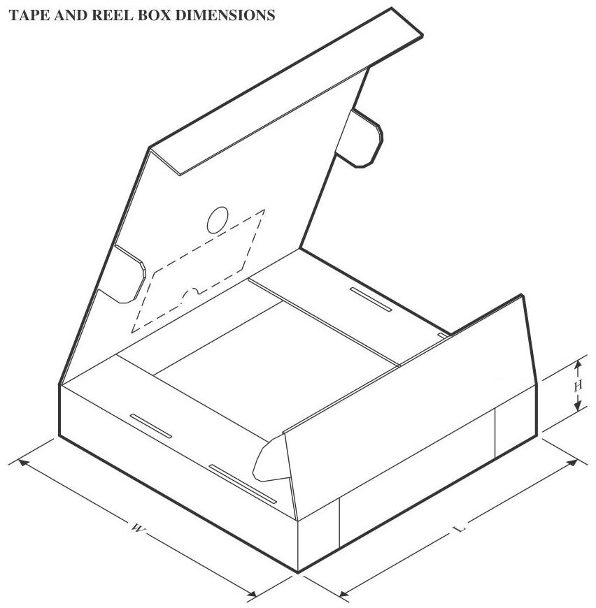

*All dimensions are nominal

|  Device | Package Type | Package Drawing | Pins | SPQ | Length (mm) | Width (mm) | Height (mm)  |
| --- | --- | --- | --- | --- | --- | --- | --- |
|  TPD1E0B04DPLR | X2SON | DPL | 2 | 15000 | 205.0 | 200.0 | 33.0  |
|  TPD1E0B04DPLRG4 | X2SON | DPL | 2 | 15000 | 205.0 | 200.0 | 33.0  |
|  TPD1E0B04DPLT | X2SON | DPL | 2 | 250 | 205.0 | 200.0 | 33.0  |
|  TPD1E0B04DPYR | X1SON | DPY | 2 | 10000 | 210.0 | 185.0 | 35.0  |
|  TPD1E0B04DPYRG4 | X1SON | DPY | 2 | 10000 | 210.0 | 185.0 | 35.0  |
|  TPD1E0B04DPYT | X1SON | DPY | 2 | 250 | 210.0 | 185.0 | 35.0  |# GENERIC PACKAGE VIEW 

## X1SON - 0.45 mm max height

$1 \times 0.6 \mathrm{~mm}$
PLASTIC SMALL OUTLINE - NO LEAD

This image is a representation of the package family, actual package may vary.
Refer to the product data sheet for package details.
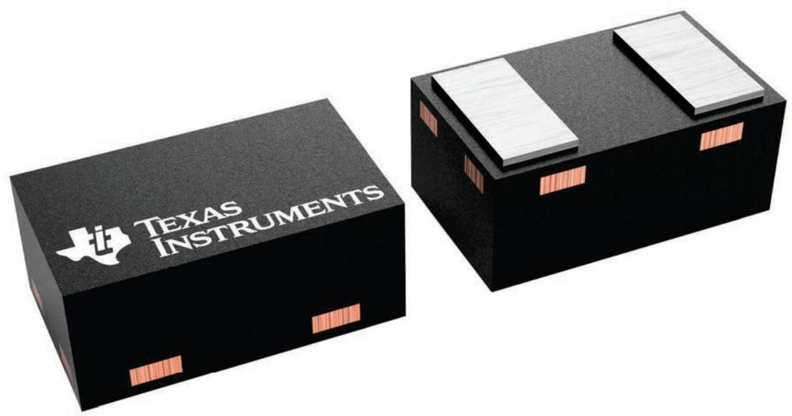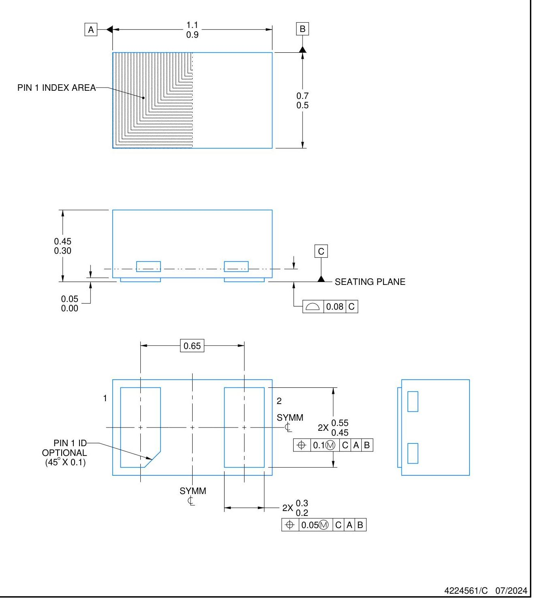

# PACKAGE OUTLINE 

## X1SON - 0.45 mm max height

PLASTIC SMALL OUTLINE - NO LEAD
$\square$
NOTES:

1. All linear dimensions are in millimeters. Any dimensions in parenthesis are for reference only. Dimensioning and tolerancing per ASME Y14.5M
2. This drawing is subject to change without notice.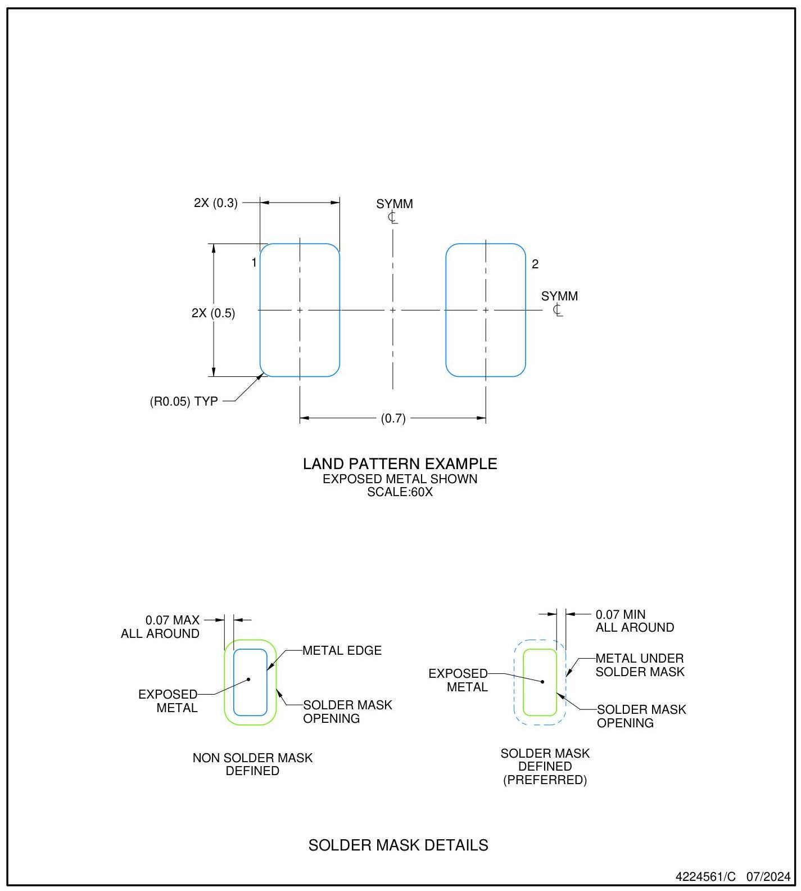

NOTES: (continued)
3. For more information, see Texas Instruments literature number SLUA271 (www.ti.com/lit/slua271).
4. Vias are optional depending on application, refer to device data sheet. If any vias are implemented, refer to their locations shown on this view. It is recommended that vias under paste be filled, plugged or tented.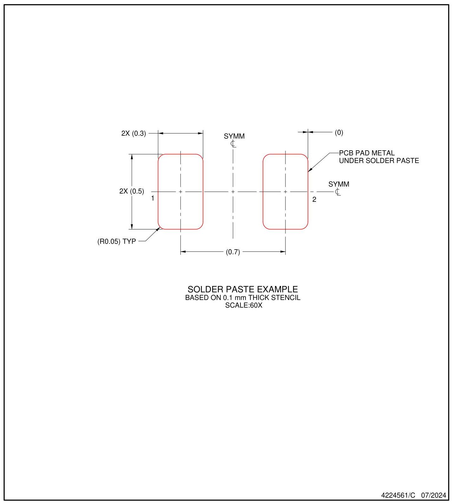

NOTES: (continued)
5. Laser cutting apertures with trapezoidal walls and rounded corners may offer better paste release. IPC-7525 may have alternate design recommendations.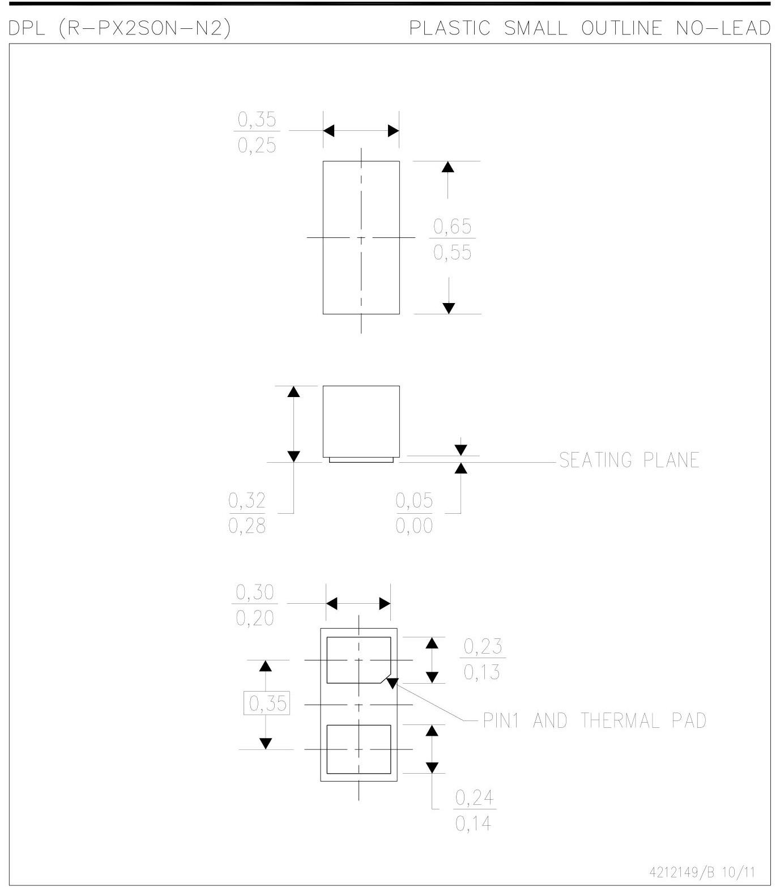

NOTES: A. All linear dimensions are in millimeters. Dimensioning and tolerancing per ASME Y14.5M-1994.
B. This drawing is subject to change without notice.
C. Small Outline No-Lead (SON) package configuration.
D. The package thermal pad must be soldered to the board for thermal and mechanical performance.# Example Board Layout 

## Example Stencil Design (Note E)

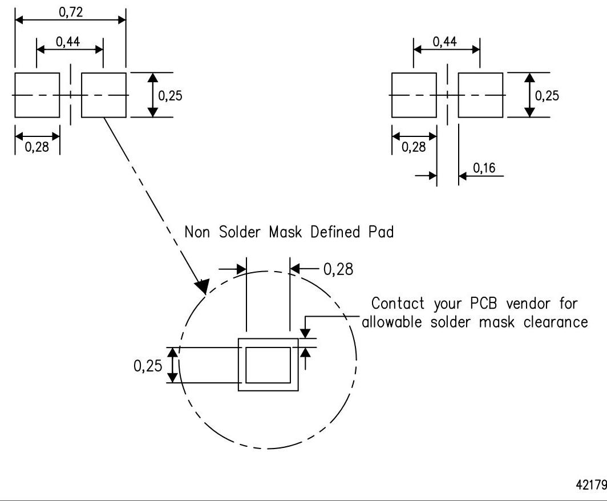

NOTES: A. All linear dimensions are in millimeters.
B. This drawing is subject to change without notice.
C. Publication IPC-7351 is recommended for alternate designs.
D. Customers should contact their board fabrication site for minimum solder mask web tolerances between signal pads.
E. Maximum stencil thickness $0,127 \mathrm{~mm}$ ( 5 mils). All linear dimensions are in millimeters.
F. Laser cutting apertures with trapezoidal walls and also rounding corners will offer better paste release. Customers should contact their board assembly site for stencil design recommendations. Refer to IPC 7525 for stencil design considerations.
G. Side aperture dimensions over-print land for acceptable area ratio $>0.66$. Customer may reduce side aperture dimensions if stencil manufacturing process allows for sufficient release at smaller opening.# IMPORTANT NOTICE AND DISCLAIMER 

TI PROVIDES TECHNICAL AND RELIABILITY DATA (INCLUDING DATA SHEETS), DESIGN RESOURCES (INCLUDING REFERENCE DESIGNS), APPLICATION OR OTHER DESIGN ADVICE, WEB TOOLS, SAFETY INFORMATION, AND OTHER RESOURCES "AS IS" AND WITH ALL FAULTS, AND DISCLAIMS ALL WARRANTIES, EXPRESS AND IMPLIED, INCLUDING WITHOUT LIMITATION ANY IMPLIED WARRANTIES OF MERCHANTABILITY, FITNESS FOR A PARTICULAR PURPOSE OR NON-INFRINGEMENT OF THIRD PARTY INTELLECTUAL PROPERTY RIGHTS.
These resources are intended for skilled developers designing with TI products. You are solely responsible for (1) selecting the appropriate TI products for your application, (2) designing, validating and testing your application, and (3) ensuring your application meets applicable standards, and any other safety, security, regulatory or other requirements.
These resources are subject to change without notice. TI grants you permission to use these resources only for development of an application that uses the TI products described in the resource. Other reproduction and display of these resources is prohibited. No license is granted to any other TI intellectual property right or to any third party intellectual property right. TI disclaims responsibility for, and you will fully indemnify TI and its representatives against, any claims, damages, costs, losses, and liabilities arising out of your use of these resources.
TI's products are provided subject to TI's Terms of Sale or other applicable terms available either on ti.com or provided in conjunction with such TI products. TI's provision of these resources does not expand or otherwise alter TI's applicable warranties or warranty disclaimers for TI products.
TI objects to and rejects any additional or different terms you may have proposed.
Mailing Address: Texas Instruments, Post Office Box 655303, Dallas, Texas 75265
Copyright © 2025, Texas Instruments Incorporated