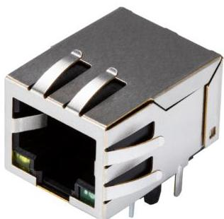
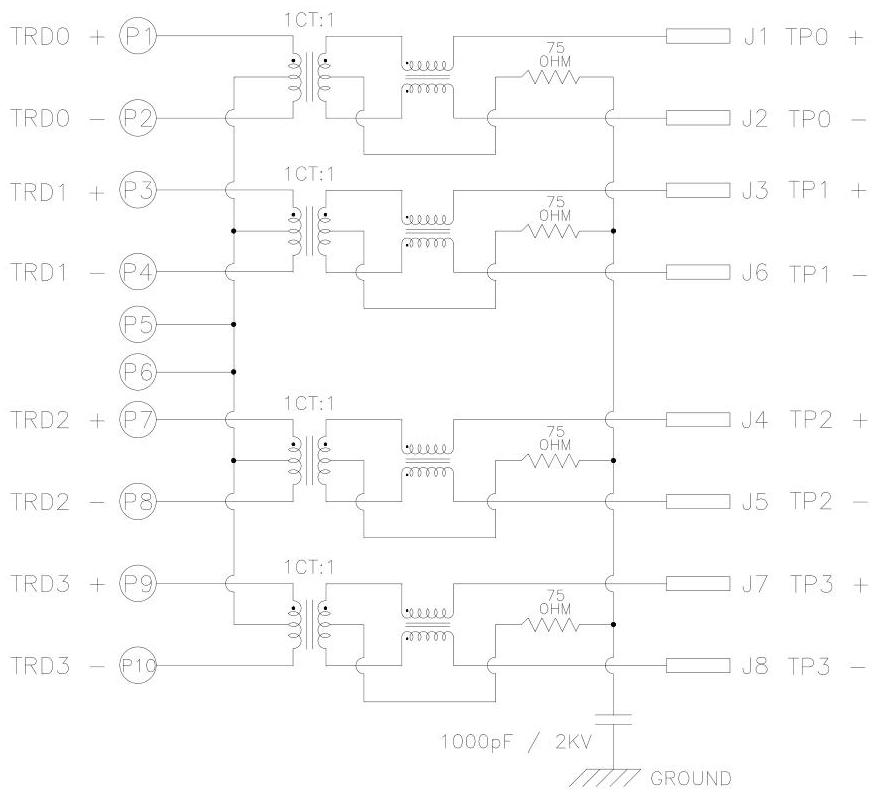
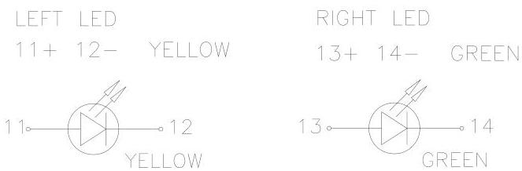
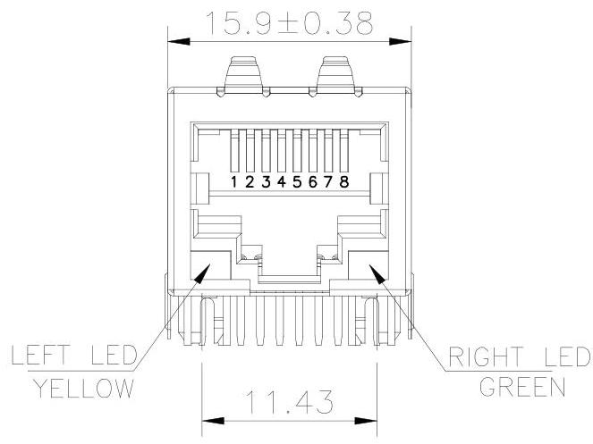
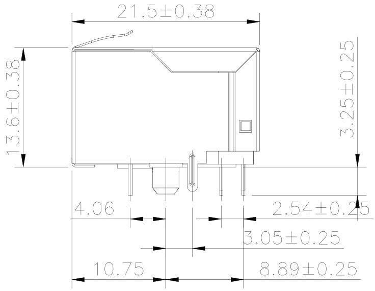
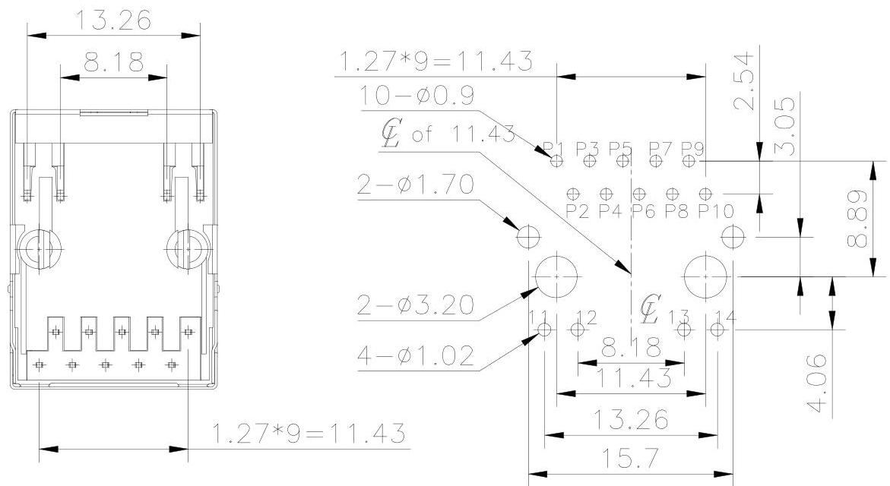

Additional Resources: Product Page | 3D Model | PCB Footprint
date 08/05/2022
page 1 of 4

# CODEVICES

# MODEL: CRJ009-ML4-TH | DESCRIPTION: MODULAR JACK

## FEATURES
- 8P10C (RJ45)
- integrated magnetics
- 10/100/1000 BaseT
- LED
- shielded

# RoHS

## SPECIFICATIONS

|  parameter | conditions/description | min | typ | max | units  |
| --- | --- | --- | --- | --- | --- |
|  rated voltage |  |  |  | 150 | Vac  |
|  rated current |  |  |  | 1.5 | A  |
|  withstanding voltage | for 1 minute |  | 1,500 |  | Vac  |
|  contact resistance |  |  |  | 40 | mΩ  |
|  insulation resistance |  | 500 |  |  | MΩ  |
|  insertion/withdrawal force |  |  |  | 6.12 | kgf  |
|  operating temperature |  | 0 |  | 70 | °C  |
|  storage temperature |  | -40 |  | 80 | °C  |
|  life |  |  | 1,000 |  | cycles  |
|  flammability rating | UL94V-0 |  |  |  |   |
|  RoHS | yes |  |  |  |   |
|  packaging | carton size: 400 x 303 x 258 mm
tray QTY: 120 pcs per tray
carton QTY: 1,200 pcs per carton |  |  |  |   |

## SOLDERABILITY

|  parameter | conditions/description | min | typ | max | units  |
| --- | --- | --- | --- | --- | --- |
|  wave soldering | for maximum 5 seconds |  |  | 260 | °C  |

cuidevices.comAdditional Resources: Product Page | 3D Model | PCB Footprint

CUI DEVICES | MODEL: CRJ009-ML4-TH | DESCRIPTION: MODULAR JACK

date 08/05/2022 | page 2 of 4

# MAGNETIC SPECIFICATIONS (AT 25°C)

|  parameter | conditions/description | min | typ | max | units  |
| --- | --- | --- | --- | --- | --- |
|  turns ratio | at 100 kHz, 0.1 V |  |  |  |   |
|   |  P1-P2 : J1-J2 = 1:1 [±5%] |  |  |  |   |
|   |  P3-P4 : J3-J8 = 1:1 [±5%] |  |  |  |   |
|   |  P7-P8 : J4-J5 = 1:1 [±5%] |  |  |  |   |
|   |  P9-P10 : J7-J8 = 1:1 [±5%] |  |  |  |   |
|  OCL | at 100 kHz, 0.1 V, 8 mA DC | 350 |  |  | μH  |
|  insertion loss | at 1.0-100 MHz |  |  | -1.0 | dB  |
|   |  at 100-125 MHz |  |  | -1.2 | dB  |
|  return loss | at 1-30 MHz | -18 |  |  | dB  |
|   |  at 30-60 MHz | -16 |  |  | dB  |
|   |  at 60-80 MHz | -12 |  |  | dB  |
|   |  at 80-100 MHz | -10 |  |  | dB  |
|  crosstalk | at 1-100 MHz | -30 |  |  | dB  |
|  common mode rejection | at 1-100 MHz | -30 |  |  | dB  |
|  hipot | input to output for 1 minute, 1 mA | 1,500 |  |  | Vac  |

# SCHEMATIC

PCB Side

Cable Side

|  LED COLOR | WAVELENGTH | FORWARD VOLTAGE at IF 20 mA  |
| --- | --- | --- |
|  Green | 565-575 nm | 2.5 V max  |
|  Yellow | 585-595 nm | 2.5 V max  |

cuidevices.comAdditional Resources: Product Page | 3D Model | PCB Footprint

CUI DEVICES | MODEL: CRJ009-ML4-TH | DESCRIPTION: MODULAR JACK

date 08/05/2022 | page 3 of 4

# MECHANICAL DRAWING

units: mm

tolerance:

X ±0.5 mm

X.X ±0.38 mm

X.XX ±0.25 mm

X.XXX ±0.10 mm

PCB: ±0.05 mm

PCB thickness: 1.6 mm

unless otherwise noted

|  ITEM | DESCRIPTION | MATERIAL | PLATING/COLOR  |
| --- | --- | --- | --- |
|  1 | insulator | NY66 (UL94V-0) | black  |
|  2 | contact terminals | phosphor bronze | contact area: 50 μ" gold over nickel solder area: tin over nickel  |
|  3 | shield | brass | nickel alloy  |

cuidevices.comAdditional Resources: Product Page | 3D Model | PCB Footprint
CUI DEVICES | MODEL: CRJ009-ML4-TH | DESCRIPTION: MODULAR JACK
date 08/05/2022 | page 4 of 4

# REVISION HISTORY

|  rev. | description | date  |
| --- | --- | --- |
|  1.0 | initial release | 03/31/2021  |
|  1.01 | logo, datasheet style update | 08/05/2022  |

The revision history provided is for informational purposes only and is believed to be accurate.

CUBVICES

CUI Devices offers a one [1] year limited warranty. Complete warranty information is listed on our website.

CUI Devices reserves the right to make changes to the product at any time without notice. Information provided by CUI Devices is believed to be accurate and reliable. However, no responsibility is assumed by CUI Devices for its use, nor for any infringements of patents or other rights of third parties which may result from its use.

CUI Devices products are not authorized or warranted for use as critical components in equipment that requires an extremely high level of reliability. A critical component is any component of a life support device or system whose failure to perform can be reasonably expected to cause the failure of the life support device or system, or to affect its safety or effectiveness.

cuidevices.com